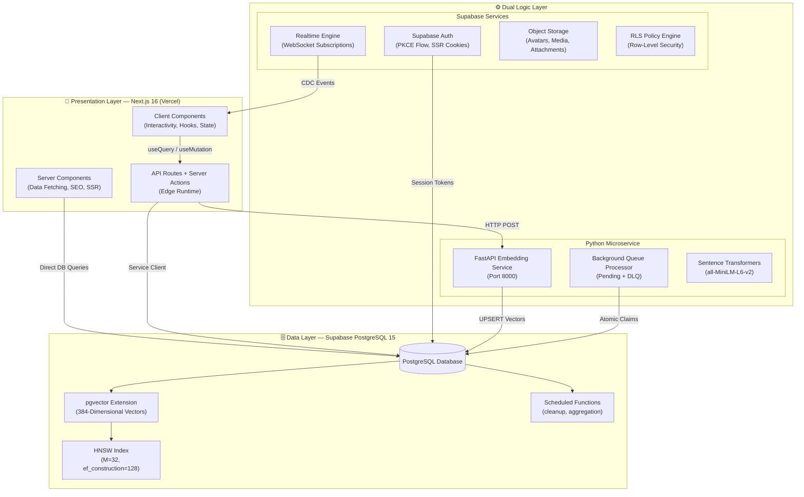
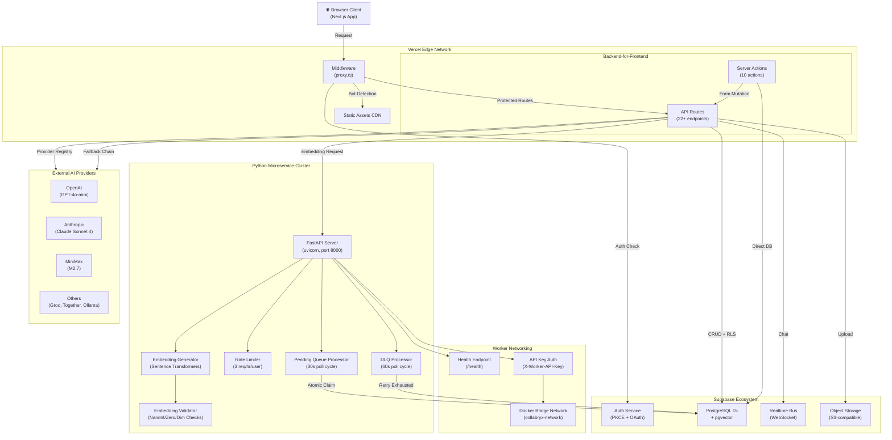
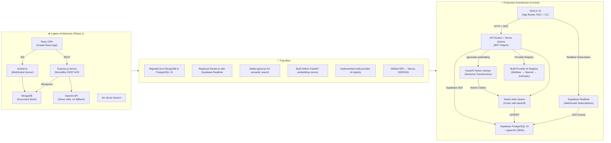

# 🏗️ High-Level & System Architecture Diagrams

> **Last Updated:** 2026-06-05  
> **Scope:** Macro-level architecture showing how Collabryx's multi-runtime stack interacts across presentation, logic, and data layers.

---

## Table of Contents

1. [Conceptual 3-Tier Architecture](#1-conceptual-3-tier-architecture)
2. [Hybrid Service-Based Microservices Topology](#2-hybrid-service-based-microservices-topology)
3. [Production Container Layout (Docker Compose)](#3-production-container-layout-docker-compose)
4. ["Before & After" Evolution Blueprint](#4-before--after-evolution-blueprint)

---

## 1. Conceptual 3-Tier Architecture

Collabryx follows a strict **3-tier architecture** that cleanly separates concerns across three independent layers. The Presentation Layer (Next.js 16) handles all user-facing rendering. The Dual Logic Layer splits business logic between Supabase (for auth, database operations, and edge functions) and the Python FastAPI worker (for compute-heavy embedding generation). The Data Layer is exclusively PostgreSQL 15 via Supabase with the pgvector extension.

### Layer Breakdown

**Presentation Layer** runs entirely on Vercel's Edge Network. Server Components fetch data directly from Supabase using the server client (`@/lib/supabase/server`) for zero client-side data exposure. Client Components handle interactivity via React 19 hooks and are placed at the lowest possible leaf nodes. API Routes and Server Actions form the backend-for-frontend (BFF) layer, handling validation with Zod, CSRF protection, and proxying requests to the Python worker.

**Dual Logic Layer** is the architectural centerpiece. Supabase handles auth (PKCE flow with SSR cookies), realtime WebSocket subscriptions for live messaging, object storage for media uploads, and enforces Row-Level Security on every query. The Python FastAPI microservice handles compute-heavy tasks: embedding generation using `all-MiniLM-L6-v2` (384 dimensions), background queue processing with atomic claim patterns, and DLQ management with exponential backoff retry (max 3 attempts).

**Data Layer** is a single Supabase PostgreSQL 15 instance with pgvector. The `profile_embeddings` table stores 384-dimensional vectors and uses an HNSW index (M=32, ef_construction=128) for fast approximate nearest-neighbor search. Scheduled functions handle data retention (cleanup old match suggestions, notification pruning).

---

## 2. Hybrid Service-Based Microservices Topology

Collabryx is **not a monolith**. It employs a hybrid topology where the Next.js application acts as an orchestrating BFF, routing requests to isolated Deno-managed edge functions and a containerized Python microservice based on workload characteristics.

### Service Boundaries

The **Next.js BFF** owns all user-facing HTTP concerns: authentication sessions, CSRF protection, input validation with Zod, and orchestration of downstream services. It never talks to the Python worker directly for latency-sensitive UI — instead, embedding generation is dispatched asynchronously and the frontend polls via Supabase Realtime.

The **FastAPI Python microservice** is completely isolated in its own Docker container with read-only root filesystem, no-new-privileges security, and a dedicated bridge network. It has no public internet access other than what's needed for the Supabase SDK. It communicates exclusively via the `X-Worker-API-Key` authenticated endpoints.

**External AI Providers** (OpenAI, Anthropic, MiniMax, and any OpenAI-compatible endpoint) are called directly by the Next.js API routes using the Provider Registry pattern. The registry auto-discovers providers from `AI_PROVIDER_N_*` environment variables, sorts by priority, and implements a fallback chain: if the preferred provider fails, it tries the next one in priority order.

---

## 3. Production Container Layout (Docker Compose)

The Python worker runs as a production-grade Docker container with defense-in-depth hardening. The Docker Compose setup maps port 8000, attaches tmpfs volumes for runtime data, sets resource limits, configures structured JSON logging, and integrates health checks.

```mermaid
graph TB
    subgraph Host["🐳 Docker Host Machine"]
        subgraph Container["collabryx-worker Container"]
            subgraph AppProcess["FastAPI Application"]
                Uvicorn["uvicorn main:app<br/>--workers 1<br/>--limit-concurrency 100"]
                AppCode["Application Code<br/>main.py, embedding_generator.py<br/>embedding_validator.py, rate_limiter.py"]
            end

            subgraph Volumes["Runtime Volumes (tmpfs)"]
                TMP["/tmp<br/>256MB, noexec, nosuid"]
                LOGS["/app/logs<br/>512MB, noexec, nosuid"]
                CACHE["/home/appuser/.cache<br/>512MB, noexec, nosuid"]
            end

            subgraph Security["Security Hardening"]
                ReadOnly["Read-Only Root Filesystem"]
                NoNewPriv["no-new-privileges: true"]
                DropAll["cap_drop: ALL"]
                AddNet["cap_add: NET_BIND_SERVICE"]
                NonRoot["Non-Root User (appuser)"]
            end
        end

        subgraph Network["Docker Network"]
            Bridge["collabryx-network<br/>(bridge driver)"]
            Port["Port Mapping<br/>8000:8000"]
        end

        subgraph Health["Health Monitoring"]
            HealthEndpoint["GET /health<br/>Interval: 30s<br/>Timeout: 5s<br/>Retries: 3<br/>Start Period: 60s"]
            ResourceLimits["Resource Limits<br/>CPU: 1.0 core<br/>Memory: 1GB<br/>Reservation: 0.5 / 512MB"]
            Logging["Logging Driver<br/>json-file<br/>max-size: 10m<br/>max-file: 3<br/>compress: true"]
        end

        subgraph EnvConfig["Environment Configuration"]
            EnvFile[".env File"]
            SupabaseURL["SUPABASE_URL"]
            ServiceKey["SUPABASE_SERVICE_ROLE_KEY"]
            AllowedOrigins["ALLOWED_ORIGINS"]
            LogLevel["LOG_LEVEL"]
        end
    end

    subgraph ExternalServices["External Dependencies"]
        Supabase["Supabase PostgreSQL<br/>+ pgvector"]
        NextJS["Next.js 16 App<br/>(Vercel/host)"]
    end

    EnvFile -->|Loaded via dotenv| Uvicorn
    SupabaseURL --> Uvicorn
    ServiceKey --> Uvicorn

    Uvicorn --> AppCode
    Uvicorn --> HealthEndpoint
    Uvicorn --> ResourceLimits
    Uvicorn --> Logging

    Port -->|:8000| Uvicorn
    Bridge --> Port
    Uvicorn -->|Supabase SDK| Supabase
    Uvicorn -->|Embedding API| NextJS

    ReadOnly --> Container
    NoNewPriv --> Container
    DropAll --> Container
    AddNet --> Container
    NonRoot --> Container
    TMP --> Container
    LOGS --> Container
    CACHE --> Container
```

### Container Security Design

The Dockerfile uses a **multi-stage build**: a `ghcr.io/astral-sh/uv:python3.11-bookworm-slim` builder stage installs CPU-only PyTorch and all Python dependencies into a virtual environment, then a `python:3.11-slim-bookworm` runtime stage copies only the venv. This keeps the final image lean. The model (`all-MiniLM-L6-v2`) is pre-downloaded during the build to prevent runtime download failures. The container runs with a read-only root filesystem — only tmpfs-mounted directories are writable (for model cache, logs, and pytest cache). The `no-new-privileges` security option prevents privilege escalation via `suid` binaries.

---

## 4. "Before & After" Evolution Blueprint

Collabryx underwent a mid-project architectural transformation from a traditional MERN + Socket.io stack to a modern, AI-native stack. This diagram shows the side-by-side comparison.

### Key Architectural Wins

| Concern | Legacy (MERN) | Current (Next.js + Supabase + Python) |
|---------|---------------|----------------------------------------|
| **Rendering** | Client-side only (SPA) | Hybrid SSR + RSC + Client Components |
| **Real-time** | Custom Socket.io server | Managed Supabase Realtime (CDC) |
| **Database** | MongoDB (no relations) | PostgreSQL 15 (ACID + RLS) |
| **Vector Search** | None | pgvector with HNSW index |
| **AI Integration** | Single OpenAI direct calls | Multi-provider registry with auto-failover |
| **Fault Tolerance** | None | DLQ with exponential backoff (3 retries) |
| **State Management** | Redux | React Query (server) + Zustand (client) |
| **Validation** | Joi on backend only | Zod everywhere (forms, API, RPC) |
| **Security** | JWT + manual checks | Supabase RLS + CSRF + Bot Detection |

The evolution eliminated a custom WebSocket server (Socket.io), replaced a document store (MongoDB) with a relational database (PostgreSQL 15 + pgvector), introduced a self-hosted embedding pipeline (Python + Sentence Transformers), and replaced single-provider AI calls with a pluggable multi-provider registry supporting OpenAI, Anthropic, MiniMax, and any OpenAI-compatible endpoint with automatic fallback.
