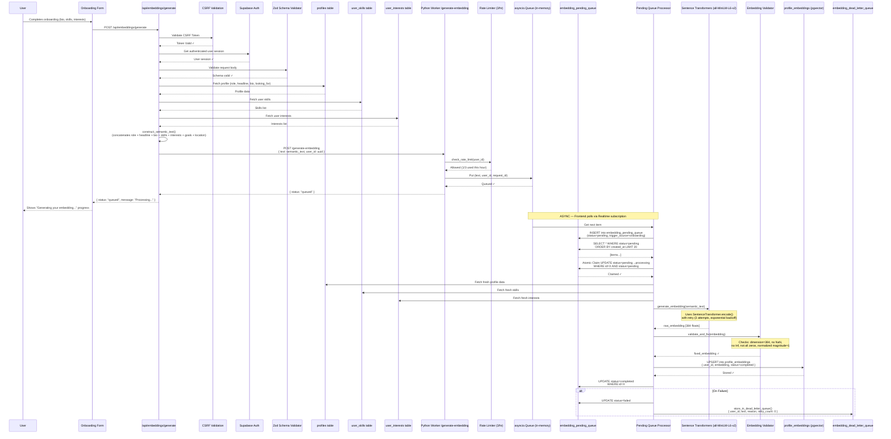
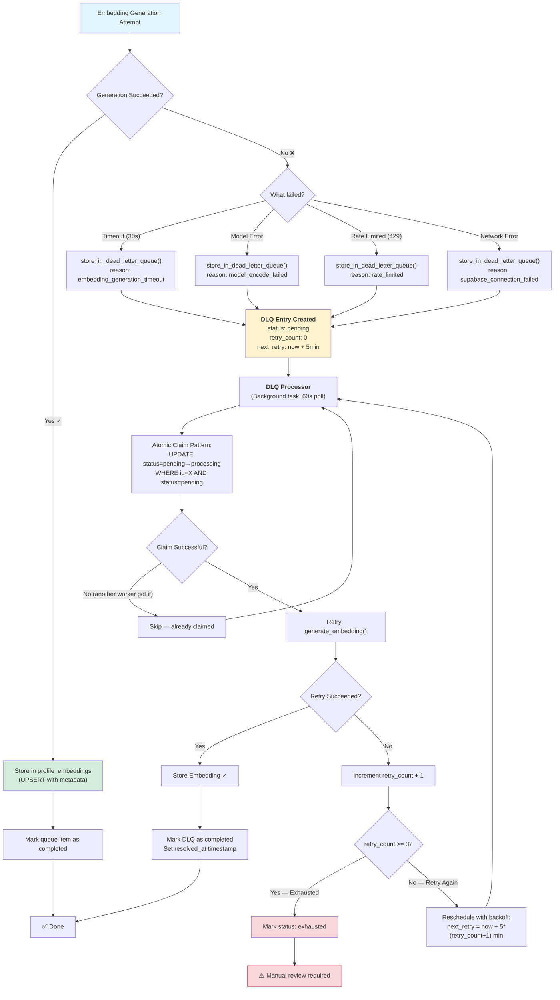
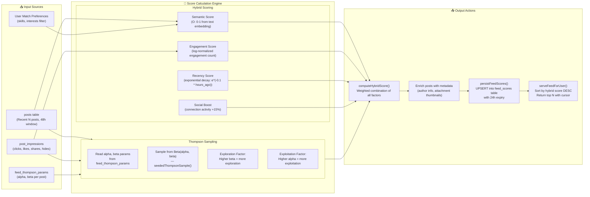
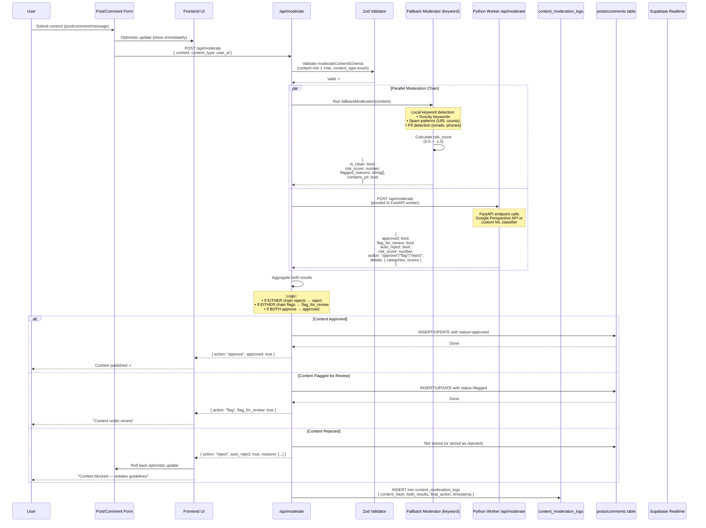
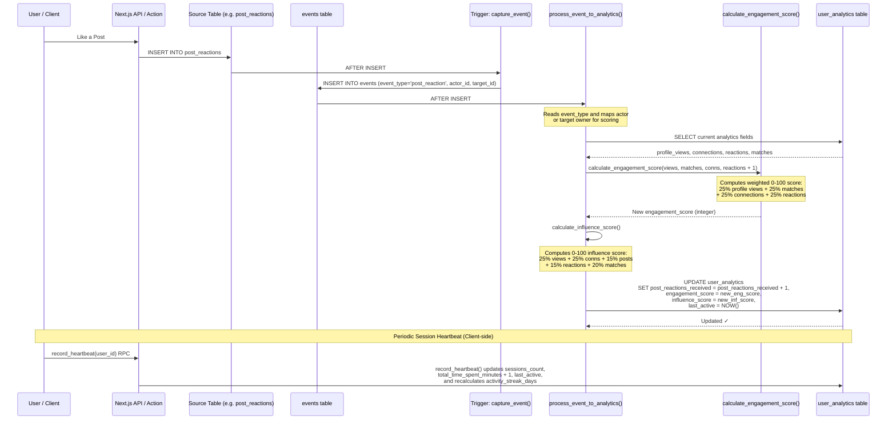
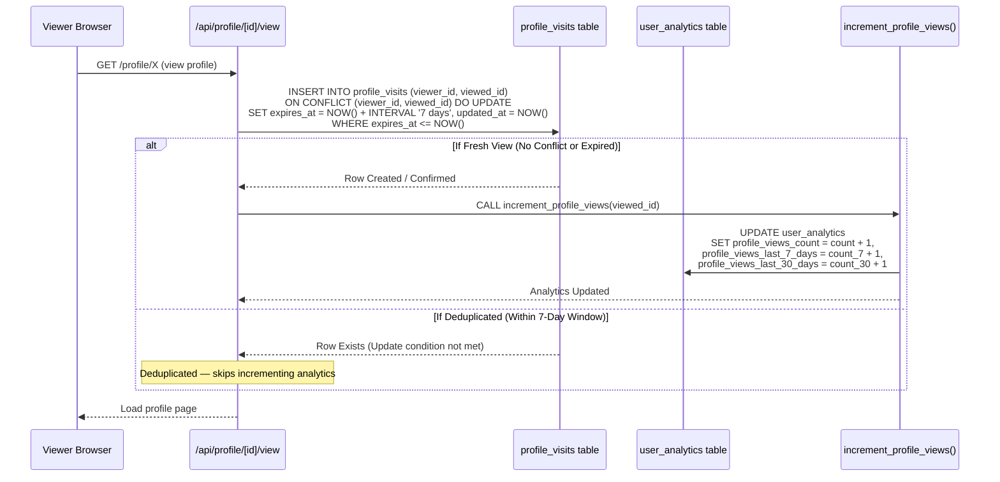
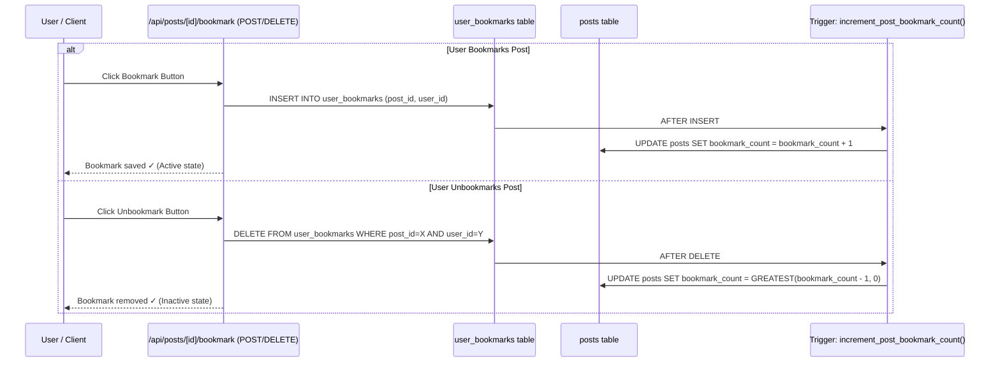

# 🔀 Data Flow & Processing Pipeline Diagrams

> **Last Updated:** 2026-06-05  
> **Scope:** Asynchronous workflows, queue management, systemic fallbacks, and content processing pipelines.

---

## Table of Contents

1. [Asynchronous Profile Embedding Pipeline](#1-asynchronous-profile-embedding-pipeline)
2. [Fault-Tolerant Dead Letter Queue (DLQ) Flow](#2-fault-tolerant-dead-letter-queue-dlq-flow)
3. [Thompson Sampling Feed Scorer Workflow](#3-thompson-sampling-feed-scorer-workflow)
4. [Dual-Chain Content Moderation Sequence](#4-dual-chain-content-moderation-sequence)
5. [Event-Driven Analytics Pipeline](#5-event-driven-analytics-pipeline)
6. [Deduplicated Profile Visits Flow](#6-deduplicated-profile-visits-flow)
7. [Dedicated Bookmarking Flow](#7-dedicated-bookmarking-flow)

---

## 1. Asynchronous Profile Embedding Pipeline

This pipeline traces the complete journey of a user's profile data from the Next.js onboarding form, through the API boundary, into the `embedding_pending_queue`, over to the Python Sentence-Transformers container, and finally into PostgreSQL with pgvector.

### Pipeline Deep Dive

The flow begins **synchronously**: when a user completes onboarding, the Next.js client calls `/api/embeddings/generate`. This endpoint performs CSRF validation, verifies the user's session (with a special allowance for unverified emails during onboarding), fetches profile data from three tables (`profiles`, `user_skills`, `user_interests`), and concatenates them with `construct_semantic_text()` into a single string limited to 2000 characters.

The request then crosses the **service boundary** via HTTP POST to the Python FastAPI worker at `/generate-embedding`. The worker immediately checks the database-backed rate limiter (3 requests per hour per user, sliding window). If allowed, the request enters an in-memory `asyncio.Queue` (max size 100, bounded) and returns `{"status": "queued"}` to the frontend.

**Asynchronous processing** begins when the `queue_processor` background task picks up the item. It first inserts into the `embedding_pending_queue` table with status `pending` and trigger source `onboarding`. The `process_pending_queue` background task (polling every 30 seconds) then performs an **atomic claim** — updating the status from `pending` to `processing` only if it's still `pending` (preventing duplicate processing by multiple worker instances).

The claim winner fetches fresh profile data, generates the embedding via `SentenceTransformer.encode()` with retry logic (3 attempts, exponential backoff 2-10 seconds), validates the resulting vector (384 dimensions, no NaN/Inf, not all zeros, normalized magnitude), and UPSERTs into `profile_embeddings` on conflict by `user_id`. On success, the queue item is marked `completed`. On failure, it's moved to the dead letter queue for retry.

---

## 2. Fault-Tolerant Dead Letter Queue (DLQ) Flow

The DLQ is the safety net for embedding generation failures. If the Python worker fails during vector computation, the system routes the failed request into the `embedding_dead_letter_queue` and retries with exponential backoff up to 3 times before marking it as `exhausted`.

### DLQ Architecture Deep Dive

The DLQ is implemented across two systems. On the **Python side**, `store_in_dead_letter_queue()` captures the failed user_id, the semantic text, a descriptive failure reason, and initializes `retry_count: 0` with `next_retry` set to `utcnow + 5 minutes`. It also attempts to update `profile_embeddings` with `status: "failed"` as a fallback marker. If even the DLQ insert fails, the system logs a **critical alert** for manual intervention.

The `process_dead_letter_queue()` background task runs every 60 seconds. It selects up to 10 eligible DLQ entries (status=`pending`, `next_retry` <= now, `retry_count` < 3). For each entry, it performs an **atomic claim**: `UPDATE status = 'processing' WHERE id = X AND status = 'pending'`. If the update returns zero affected rows, another worker has already claimed it — the item is safely skipped. This pattern prevents the thundering-herd problem in multi-worker deployments.

On the **Next.js side**, the `/api/embeddings/retry-dlq` endpoint allows **manual retry** of exhausted DLQ items. It validates CSRF tokens, checks that the item isn't already completed or exhausted, resets the DLQ entry to `pending` with a fresh `next_retry` timestamp, and calls the Python worker for immediate processing. If the worker is unavailable, the item stays `pending` for the automatic processor to pick up later. The admin dashboard at `embedding-queue-admin` exposes a full UI for monitoring DLQ items with user info, failure reasons, retry counts, and a "Retry" button.

---

## 3. Thompson Sampling Feed Scorer Workflow

The feed scorer uses **Thompson Sampling** (a multi-armed bandit algorithm) to dynamically rank posts in each user's dashboard feed. It balances exploitation (showing posts known to perform well for this user) with exploration (trying new content to discover engagement).

### Thompson Sampling Mechanics

The `feed_scorer.ts` service implements `seededThompsonSample(alpha, beta)` which draws a random sample from the Beta distribution defined by the post's alpha (successes) and beta (failures) parameters. Posts with higher sampled values are shown more often. When a user engages with a post (clicks, likes), the post's alpha is incremented — increasing its probability of being shown again. When a user skips or hides a post, beta is incremented — decreasing it.

The `calculateHybridScore()` function combines the Thompson sample (40% weight) with a semantic relevance score (30%), recency score with exponential decay (20%), and social connection boost (10%). The final score determines the ranking in the user's feed.

Scores are persisted to the `feed_scores` table with a 24-hour Time-to-Live (TTL). The `cleanupExpiredFeedScores()` function is called after each batch to remove stale entries. The feed is served to the frontend via cursor-based pagination for infinite scroll.

---

## 4. Dual-Chain Content Moderation Sequence

User-generated content (posts, comments, messages) passes through a **dual-chain moderation pipeline** — a cloud-based ML API (Google Perspective) and local keyword-based filtering. Both chains run asynchronously and in parallel.

### Dual-Chain Verification Logic

The moderation pipeline is implemented in `/app/api/moderate/route.ts`. It first validates the input with a Zod schema ensuring `content` is at least 1 character and `content_type` is one of `post`, `comment`, `message`, or `profile`. Then it fires **two parallel async chains**:

1. **Fallback Moderator** — A purely local, zero-dependency keyword-based filter implemented inline. It checks for toxicity keywords, spam patterns (more than 3 URLs), and PII (email regex, phone number patterns). This runs immediately (no network latency) and always returns a result.

2. **Python Worker Proxy** — Forwards the content to the FastAPI worker's `/api/moderate` endpoint (which integrates with Google's Perspective API for toxicity classification). If the Python worker is unreachable, this chain times out and the fallback result alone determines the action.

The **aggregation logic** is conservative: if either chain suggests rejection, the content is rejected. If either chain suggests flagging, it's flagged for human admin review. Only if both chains approve is the content published immediately. All decisions are logged to `content_moderation_logs` with both results for audit trail.

If the Python worker is completely offline, the system degrades gracefully: the fallback moderator runs independently and the content is accepted with a lower confidence score. The API response includes the `risk_score` and `action` fields so the frontend can display appropriate messaging.

---

## 5. Event-Driven Analytics Pipeline

The analytics engine processes platform activity asynchronously. When users perform core actions, database-level triggers write record changes to the central `events` table. An event insert trigger automatically fires the analytics processing pipeline to update counters and recalculate metrics.

### Analytics Pipeline Design

The analytics architecture decouples action recording from metric computation. API routes focus on mutating state, while triggers capture those mutations into the `events` table. The `process_event_to_analytics()` function centralizes processing, updating the `user_analytics` table atomically.

Mathematical scoring functions (`calculate_engagement_score()` and `calculate_influence_score()`) are implemented as pure SQL functions with `IMMUTABLE` logic, ensuring consistent performance. The client triggers a session heartbeat every minute (`record_heartbeat()`), allowing the system to update active status, track daily active streaks, and increment total session minutes.

---

## 6. Deduplicated Profile Visits Flow

To prevent spam and skewing of metrics, profile views are deduplicated over a sliding 7-day window. When a user views another user's profile, a `profile_visits` record is upserted. If they view the same profile within 7 days, the view is deduplicated; after 7 days, it registers as a new view.

### Deduplication Mechanics

The deduplication is enforced by a compound unique index on the `profile_visits` table: `UNIQUE(viewer_id, viewed_id)`. The query utilizes the `ON CONFLICT` clause to only perform updates if the previous visit record has expired (`expires_at <= NOW()`). When a fresh view is recorded, the security definer function `increment_profile_views()` updates the target user's `user_analytics` counters without granting the viewer direct write access to the analytics table.

---

## 7. Dedicated Bookmarking Flow

Bookmarking was migrated from an emoji reaction hack (`post_reactions` using the `🔖` emoji) to a dedicated `user_bookmarks` table. This improves indexing, security, and enables precise user-facing bookmark tracking.

### Migration and Count Triggers

The dedicated table `user_bookmarks` includes a `UNIQUE(post_id, user_id)` constraint to prevent duplicate bookmarks. The `posts` table includes a `bookmark_count` integer column, which is atomically updated via database-level triggers on insert/delete. In addition, the `increment_post_counter()` RPC function was updated to support atomic `bookmark_count` mutations. Stale emoji reactions (`emoji = '🔖'`) were migrated from `post_reactions` into `user_bookmarks` and deleted from reactions.

