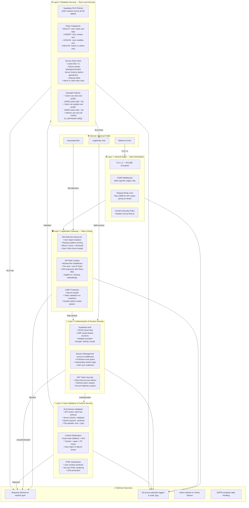
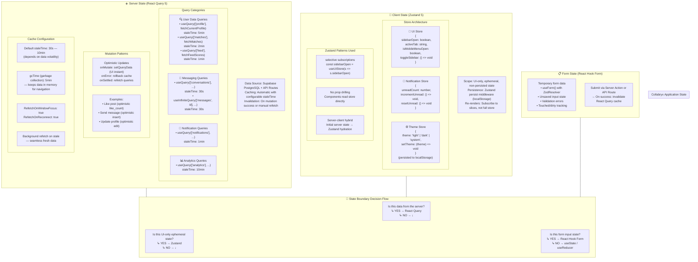

# 🗄️ Database, Storage & Security Diagrams

> **Last Updated:** 2026-06-05  
> **Scope:** Relational schema design, multi-layer enterprise security, and frontend state architecture.

---

## Table of Contents

1. [Complete Entity-Relationship Diagram (ERD)](#1-complete-entity-relationship-diagram-erd)
2. [5-Layer Enterprise Security Hierarchy](#2-5-layer-enterprise-security-hierarchy)
3. [Client State vs. Server State Separation Map](#3-client-state-vs-server-state-separation-map)

---

## 1. Complete Entity-Relationship Diagram (ERD)

Collabryx's database contains **38 tables** across functional domains: core identity, user extensions, social features, messaging, matching system, embedding reliability, ML feature engineering, privacy/security, notifications, and analytics. This ERD captures the full relational landscape with accurate relationships, indexing keys, and the vector(384) data type.

```mermaid
erDiagram
    %% ===== CORE IDENTITY =====
    profiles {
        uuid id PK
        text email "Synced from Auth"
        text display_name
        text full_name
        text headline "Max 140 chars"
        text bio "Max 1000 chars"
        text avatar_url
        text banner_url
        text location
        text website_url
        text collaboration_readiness "available | open | not-available"
        boolean is_verified
        text verification_type "student | faculty | alumni"
        text university
        integer profile_completion
        text[] looking_for
        boolean onboarding_completed
        timestamptz created_at
        timestamptz updated_at
    }

    %% ===== USER EXTENSIONS =====
    user_skills {
        uuid id PK
        uuid user_id FK
        text skill_name
        text proficiency "beginner | intermediate | advanced | expert"
        boolean is_primary
        timestamptz created_at
    }

    user_interests {
        uuid id PK
        uuid user_id FK
        text interest
        timestamptz created_at
    }

    user_experiences {
        uuid id PK
        uuid user_id FK
        text title
        text company
        text description
        date start_date
        date end_date "null = current"
        timestamptz created_at
    }

    user_projects {
        uuid id PK
        uuid user_id FK
        text title
        text description
        text url
        text[] technologies
        timestamptz created_at
    }

    %% ===== EMBEDDINGS =====
    profile_embeddings {
        uuid id PK
        uuid user_id FK, UK
        vector embedding "384 dimensions"
        text status
        jsonb metadata
        text error_message
        timestamptz last_updated
        %% HNSW index on embedding
    }

    %% ===== QUEUE TABLES =====
    embedding_pending_queue {
        uuid id PK
        uuid user_id UK
        text status "pending | processing | completed | failed"
        text trigger_source "onboarding | manual | admin | api"
        jsonb metadata
        timestamptz created_at
        timestamptz first_attempt
        timestamptz last_attempt
        timestamptz completed_at
        text failure_reason
    }

    embedding_dead_letter_queue {
        uuid id PK
        uuid user_id FK
        text semantic_text
        text failure_reason
        int retry_count
        int max_retries "Default 3"
        text status "pending | processing | completed | exhausted"
        timestamptz last_attempt
        timestamptz next_retry
        timestamptz created_at
        timestamptz resolved_at
    }

    embedding_rate_limits {
        uuid id PK
        uuid user_id
        int request_count
        timestamptz window_start
        timestamptz created_at
    }

    %% ===== SOCIAL =====
    posts {
        uuid id PK
        uuid author_id FK
        text content
        text post_type "project-launch | teammate-request | announcement | general"
        text intent "cofounder | teammate | mvp | fyp"
        text link_url
        boolean is_pinned
        boolean is_archived
        int reaction_count
        int comment_count
        int share_count
        int bookmark_count
        int version "Optimistic concurrency"
        timestamptz created_at
        timestamptz updated_at
    }

    post_attachments {
        uuid id PK
        uuid post_id FK
        text file_url
        text file_type
        text storage_path
        int file_size
        timestamptz created_at
    }

    post_reactions {
        uuid id PK
        uuid user_id FK
        uuid post_id FK
        text reaction_type "like | love | celebrate | support"
        timestamptz created_at
        %% UK(user_id, post_id)
    }

    comments {
        uuid id PK
        uuid post_id FK
        uuid user_id FK
        uuid parent_id FK "Self-ref for replies"
        text content
        int like_count
        timestamptz created_at
        timestamptz updated_at
    }

    comment_likes {
        uuid id PK
        uuid user_id FK
        uuid comment_id FK
        timestamptz created_at
        %% UK(user_id, comment_id)
    }

    %% ===== CONNECTIONS =====
    connections {
        uuid id PK
        uuid requester_id FK
        uuid receiver_id FK
        text status "pending | accepted | declined | blocked"
        text message
        timestamptz created_at
        timestamptz updated_at
    }

    blocked_users {
        uuid id PK
        uuid blocker_id FK
        uuid blocked_id FK
        text reason
        timestamptz created_at
    }

    %% ===== MATCHING =====
    match_suggestions {
        uuid id PK
        uuid user_id FK
        uuid suggested_user_id FK
        float similarity_score
        text status "pending | viewed | dismissed | connected"
        timestamptz created_at
    }

    match_scores {
        uuid id PK
        uuid suggestion_id FK
        float semantic_score
        float skills_score
        float interests_score
        float activity_score
        float reciprocity_score
        float total_score
        timestamptz created_at
    }

    match_activity {
        uuid id PK
        uuid match_id FK
        uuid user_id FK
        text activity_type "viewed_profile | sent_request | accepted"
        timestamptz created_at
    }

    match_preferences {
        uuid id PK
        uuid user_id FK, UK
        text preferred_role
        text[] preferred_skills
        int min_experience_level
        int max_distance_km
        bool show_only_complementary
        jsonb filters
        timestamptz updated_at
    }

    %% ===== MESSAGING =====
    conversations {
        uuid id PK
        uuid participant_1 FK
        uuid participant_2 FK
        text last_message_preview
        timestamptz last_message_at
        timestamptz created_at
    }

    messages {
        uuid id PK
        uuid conversation_id FK
        uuid sender_id FK
        text text
        boolean is_read
        text attachment_url
        text attachment_type "image | file"
        timestamptz read_at "null = unread"
        timestamptz created_at
    }

    %% ===== AI MENTOR =====
    ai_mentor_sessions {
        uuid id PK
        uuid user_id FK
        text title
        jsonb metadata "Startup context, session summary"
        timestamptz created_at
        timestamptz updated_at
    }

    ai_mentor_messages {
        uuid id PK
        uuid session_id FK
        uuid user_id FK "null = AI"
        text content
        text role "user | assistant"
        jsonb metadata "Tokens used, model, provider"
        timestamptz created_at
    }

    %% ===== NOTIFICATIONS =====
    notifications {
        uuid id PK
        uuid user_id FK
        text type "new_message | match_found | connection_request | ..."
        jsonb data
        bool read
        timestamptz created_at
    }

    notification_preferences {
        uuid id PK
        uuid user_id FK, UK
        bool new_message "Default true"
        bool match_found "Default true"
        bool connection_request "Default true"
        bool daily_digest
        timestamptz updated_at
    }

    %% ===== ANALYTICS & ML =====
    feed_scores {
        uuid id PK
        uuid user_id FK
        uuid post_id FK
        float score
        float thompson_sample
        jsonb score_components
        timestamptz expires_at "24h TTL"
        timestamptz created_at
    }

    feed_thompson_params {
        uuid id PK
        uuid post_id FK, UK
        float alpha "Success count (engagement)"
        float beta "Failure count (skip/hide)"
        timestamptz updated_at
    }

    post_impressions {
        uuid id PK
        uuid user_id FK
        uuid post_id FK
        text action "view | click | like | hide | share"
        timestamptz created_at
    }

    events {
        uuid id PK
        uuid user_id FK
        text event_type
        jsonb properties
        timestamptz created_at
    }

    user_analytics {
        uuid id PK
        uuid user_id FK
        text metric_type
        int metric_value
        date metric_date
        timestamptz created_at
    }

    platform_analytics {
        uuid id PK
        date snapshot_date
        int total_users
        int active_users_daily
        int new_users
        int total_connections
        int total_matches
        timestamptz created_at
    }

    content_moderation_logs {
        uuid id PK
        text content_hash
        text content_type "post | comment | message | profile"
        float risk_score
        text action "approve | flag | reject"
        jsonb details "Both chain results"
        timestamptz created_at
    }

    %% ===== PRIVACY & AUDIT =====
    privacy_settings {
        uuid id PK
        uuid user_id FK, UK
        bool show_profile "True"
        bool show_skills "True"
        bool show_activity "True"
        bool allow_messages "True"
        timestamptz updated_at
    }

    audit_logs {
        uuid id PK
        uuid user_id FK
        text action
        text entity_type
        uuid entity_id
        jsonb old_values
        jsonb new_values
        text ip_address
        timestamptz created_at
    }

    theme_preferences {
        uuid id PK
        uuid user_id FK, UK
        text theme "light | dark | system"
        timestamptz updated_at
    }

    profile_visits {
        uuid id PK
        uuid viewer_id FK
        uuid viewed_id FK
        timestamptz viewed_at
        timestamptz expires_at
        timestamptz created_at
        timestamptz updated_at
    }

    user_bookmarks {
        uuid id PK
        uuid post_id FK
        uuid user_id FK
        timestamptz created_at
    }

    %% ===== RELATIONSHIPS =====
    profiles ||--o{ user_skills : "has"
    profiles ||--o{ user_interests : "has"
    profiles ||--o{ user_experiences : "has"
    profiles ||--o{ user_projects : "has"
    profiles ||--|| profile_embeddings : "has"
    profiles ||--o{ posts : "creates"
    profiles ||--o{ comments : "writes"
    profiles ||--o{ post_reactions : "reacts"
    profiles ||--o{ connections : "initiates"
    profiles ||--o{ conversations : "participates"
    profiles ||--o{ messages : "sends"
    profiles ||--o{ notifications : "receives"
    profiles ||--o{ ai_mentor_sessions : "has"
    profiles ||--o{ feed_scores : "scored"
    profiles ||--o{ events : "generates"
    profiles ||--o{ privacy_settings : "configures"
    profiles ||--o{ theme_preferences : "configures"
    profiles ||--o{ audit_logs : "logs"
    profiles ||--o{ match_preferences : "configures"
    profiles ||--o{ embedding_rate_limits : "rate limited"
    profiles ||--o{ blocked_users : "blocks"
    profiles ||--o{ profile_visits : "viewer"
    profiles ||--o{ profile_visits : "viewed"
    profiles ||--o{ user_bookmarks : "bookmarks"

    posts ||--o{ post_attachments : "has"
    posts ||--o{ post_reactions : "receives"
    posts ||--o{ comments : "contains"
    posts ||--o{ feed_scores : "scored in"
    posts ||--o{ feed_thompson_params : "tracks"
    posts ||--o{ post_impressions : "has"
    posts ||--o{ user_bookmarks : "referenced in"

    comments ||--o{ comment_likes : "receives"
    comments ||--o{ comments : "replies" "self-ref parent_id"

    match_suggestions ||--o{ match_scores : "scored by"
    match_suggestions ||--o{ match_activity : "tracks"
    match_suggestions }|--|| profiles : "suggests to"
    match_suggestions }|--|| profiles : "suggests"

    conversations ||--o{ messages : "contains"
    ai_mentor_sessions ||--o{ ai_mentor_messages : "contains"

    profiles ||--o{ embedding_pending_queue : "queued for"
    profiles ||--o{ embedding_dead_letter_queue : "failed for"

    connections }|--|| profiles : "requester"
    connections }|--|| profiles : "receiver"
    blocked_users }|--|| profiles : "blocker"
    blocked_users }|--|| profiles : "blocked"
```

### Schema Design Patterns

**38 tables** organized into 10 functional groups. Every table uses UUID primary keys. The `profiles` table is the central hub, connected to all user-owned data. The vector embedding is stored as `vector(384)` in `profile_embeddings` with an HNSW index (`vector_cosine_ops, M=32, ef_construction=128`) for efficient similarity search. Queue tables (`embedding_pending_queue`, `embedding_dead_letter_queue`) use a `user_id` unique constraint to prevent duplicate entries per user and employ atomic claim patterns (`UPDATE ... WHERE status = 'pending'`) for multi-worker safety. The `feed_thompson_params` table stores alpha/beta parameters for the Thompson Sampling bandit algorithm, updated on each user engagement action.

---

## 2. 5-Layer Enterprise Security Hierarchy

Collabryx implements a defense-in-depth security architecture with five distinct layers, from network edge to database row-level policies.

### Defense-in-Depth Details

**Layer 1 (Network Edge)** — All traffic is encrypted with TLS 1.3. The CORS middleware in the Python worker restricts origins to the configured `ALLOWED_ORIGINS` (default: `http://localhost:3000`). Next.js sets Content-Security-Policy headers. The `proxy.ts` middleware enforces a 10MB request body limit for API routes.

**Layer 2 (Application Gateway)** — Bot detection runs first in the middleware: `checkBot()` analyzes User-Agent, path patterns, and request characteristics. If `shouldBlockBot()` returns true, the request is rejected with HTTP 403 and an `X-Bot-Score` header. API rate limiting applies per-endpoint: the notification cleanup endpoint allows 10 requests per hour, the embedding generation endpoint has per-user limits enforced by the Python worker (3 requests per hour per user with sliding window via `embedding_rate_limits` table). CSRF protection uses a double-submit cookie pattern on all state-changing requests.

**Layer 3 (Authentication)** — Supabase Auth handles PKCE OAuth flow with SSR cookie-based sessions. The `proxy.ts` middleware checks for authenticated sessions on protected routes (`/dashboard`, `/assistant`, `/matches`, `/messages`, `/my-profile`, `/notifications`, etc.) and redirects to `/login` with a `redirectTo` parameter for post-login navigation.

**Layer 4 (Input Validation)** — Every API endpoint validates with a dedicated Zod schema. Server Actions use schema validation before any database operation. File uploads are limited by both size and MIME type. The content moderation pipeline acts as a secondary filter, scanning for toxicity, spam, and PII.

**Layer 5 (Database RLS)** — All 38 tables have Row-Level Security enabled with over 100 policies. The pattern is consistent: `SELECT` policies allow users to read their own data, `INSERT` policies verify the user is creating their own record (using `auth.uid()` = user_id), `UPDATE` policies check ownership, and `DELETE` policies require ownership or admin role. The service role key is used exclusively by the Python worker (for background embedding operations) and by server-side admin actions — it is **never** exposed to client-side code.

---

## 3. Client State vs. Server State Separation Map

Collabryx strictly separates data responsibilities between the server and client. Server-managed data is cached and validated via **React Query 5** (TanStack Query), while interactive, volatile UI interface state is captured by **Zustand 5**.

### State Separation Principles

**React Query 5** owns all server-derived data: profiles, matches, feed scores, messages, notifications, and analytics. Each query has a configurable `staleTime` based on data volatility: profile data is cached for 5 minutes (it changes infrequently), feed scores for 1 minute (new posts arrive), messages for 30 seconds (high churn). Mutations use optimistic updates: when a user likes a post, the UI increments the count immediately via `setQueryData`, and on server confirmation the cache is reconciled. If the mutation fails, the optimistic update is rolled back transparently.

**Zustand 5** owns client-only UI state: sidebar open/closed, active tab selection, mobile menu visibility, and theme preference. Each store is a lightweight object with selective subscription (`useUIStore(s => s.sidebarOpen)`) to prevent unnecessary re-renders. The theme store uses Zustand's `persist` middleware to save to localStorage. Zustand stores are **never** used for server data — that would bypass React Query's caching, deduplication, and background refetching.

**React Hook Form** owns form input state: the onboarding wizard, profile editor, and post creator. Each form is validated against a Zod schema on every change (or on submit, depending on the UX requirement). On successful submission, the form calls a Server Action or API route, which invalidates the relevant React Query cache keys to trigger a refetch.

The **decision boundary** is simple: if the data originates from the server (database, API), it goes in React Query. If it's UI-only ephemeral state (modals, toggles, selections), it goes in Zustand. If it's form input, it goes in React Hook Form. This strict separation prevents the common anti-pattern of duplicating server state in client stores.
