# Architecture Diagrams

**Last Updated:** 2026-03-16  
**Version:** 1.0.0

Visual diagrams illustrating Collabryx system architecture, data flows, and component relationships.

---

## Table of Contents

- [System Architecture](#system-architecture)
- [Component Hierarchy](#component-hierarchy)
- [Data Flow Diagrams](#data-flow-diagrams)
- [Database Relationships](#database-relationships)
- [Deployment Architecture](#deployment-architecture)
- [Security Architecture](#security-architecture)

---

## System Architecture

### High-Level Overview

### Technology Stack Layers

```mermaid
graph LR
    subgraph Presentation["Presentation Layer"]
        React[React 19]
        NextJS[Next.js 16]
        R3F[React Three Fiber]
    end
    
    subgraph State["State Management"]
        Zustand[Zustand 5]
        ReactQuery[React Query 5]
    end
    
    subgraph Business["Business Logic"]
        Services[lib/services/]
        Hooks[Custom Hooks]
        Actions[Server Actions]
    end
    
    subgraph Data["Data Layer"]
        Supabase[Supabase]
        PostgreSQL[PostgreSQL 15]
        pgvector[pgvector]
    end
    
    Presentation --> State
    State --> Business
    Business --> Data
```

---

## Component Hierarchy

### Component Tree

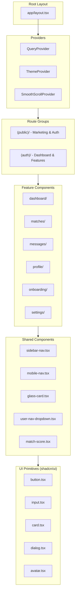

### Feature Component Structure

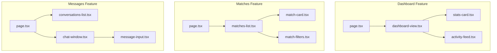

---

## Data Flow Diagrams

### Authentication Flow

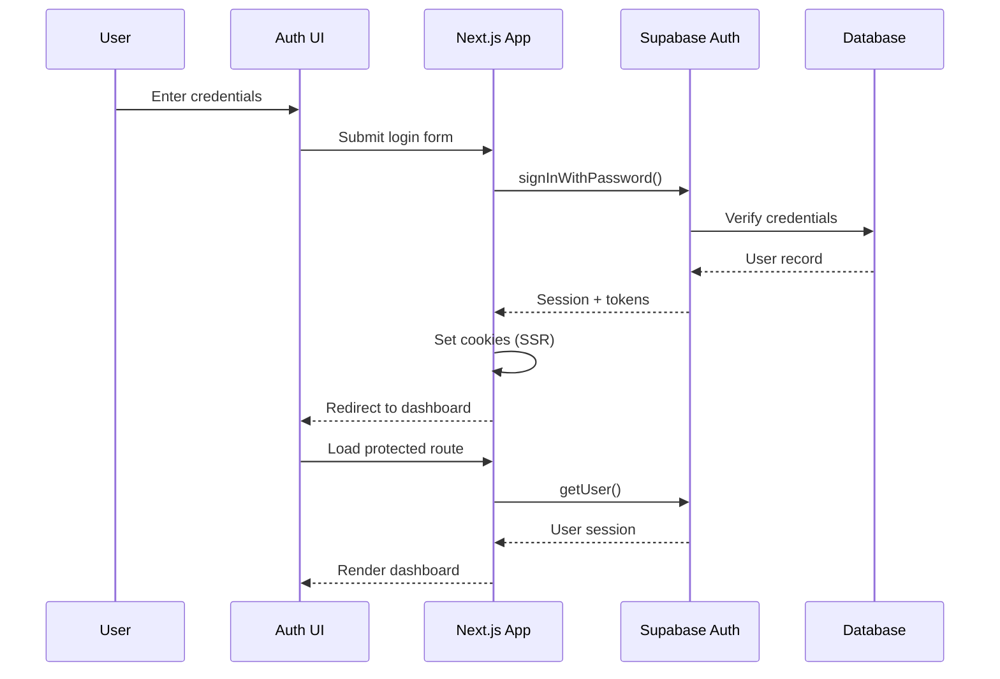

### Post Creation Flow

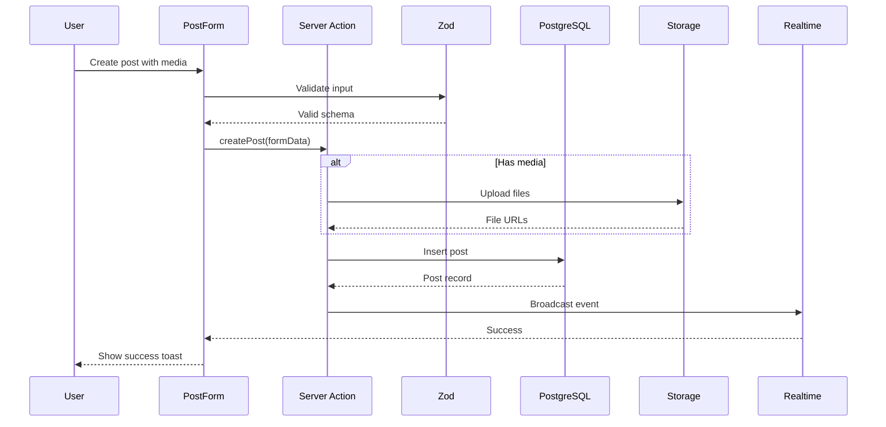

### Matching Algorithm Flow

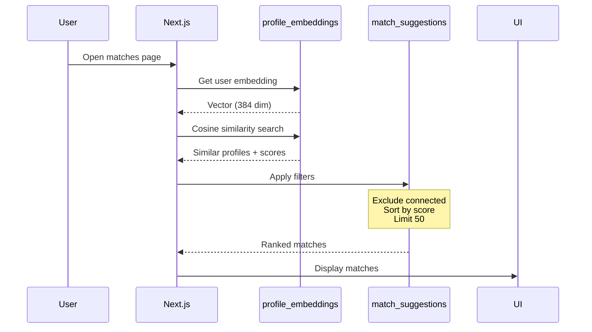

### Embedding Pipeline

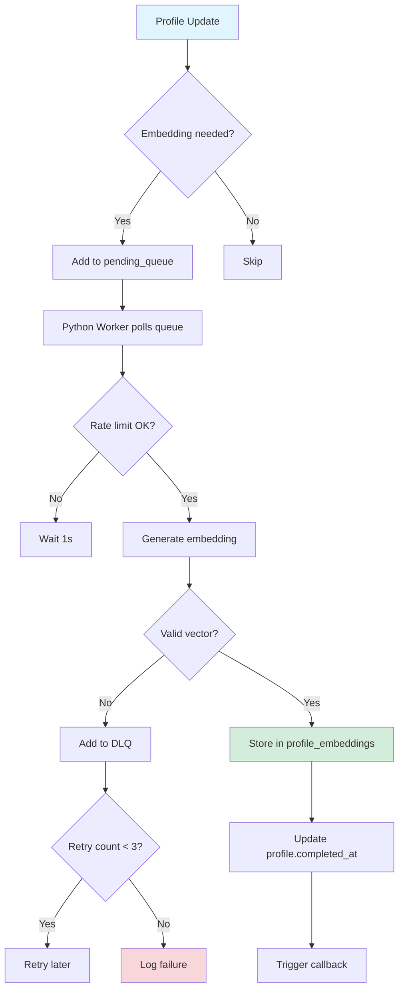

### Real-time Message Flow

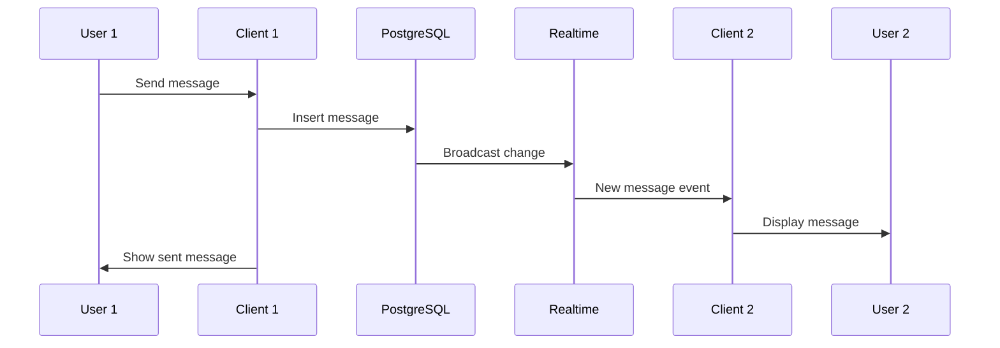

---

## Database Relationships

### Entity Relationship Diagram

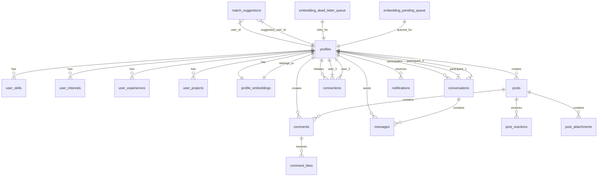

### Table Dependencies

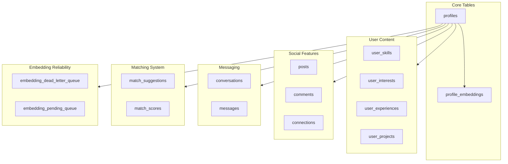

---

## Deployment Architecture

### Production Infrastructure

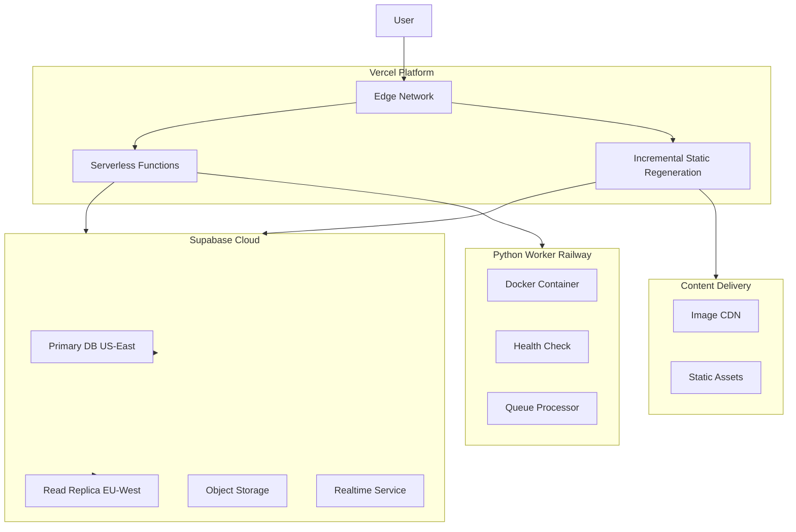

### Environment Flow

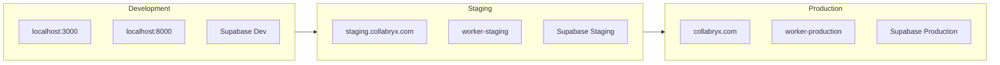

---

## Security Architecture

### Security Layers

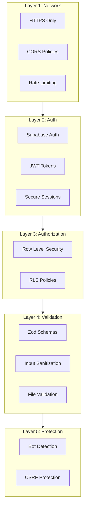

### RLS Policy Flow

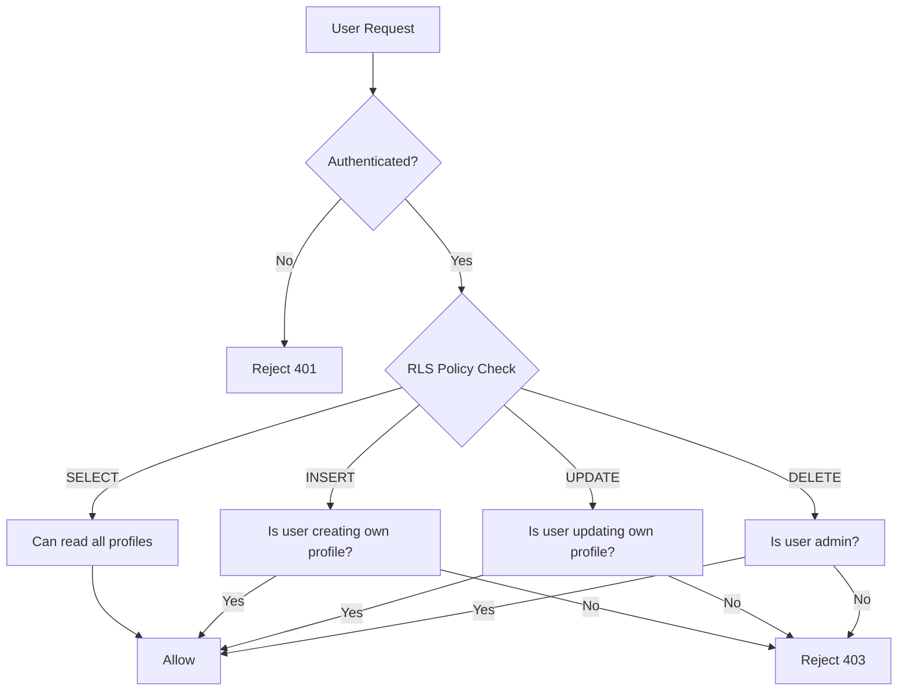

---

## Related Documentation

- [Architecture Overview](./ARCHITECTURE.md) - Detailed architecture documentation
- [Deployment Guide](./DEPLOYMENT.md) - Deployment instructions
- [API Reference](./API-REFERENCE.md) - All API endpoints
- [Security Guide](./SECURITY.md) - Security features

---

**Document Version:** 1.0.0  
**Last Reviewed:** 2026-03-16  
**Maintained By:** Architecture Team
