# Architecture Diagrams

**Last Updated:** 2026-06-05  
**Version:** 1.2.0  
**Changes:** Updated database schemas to align with 38-table production schema (added profile_visits and user_bookmarks; removed legacy connection_requests).

Visual diagrams illustrating Collabryx system architecture, data flows, and component relationships.

---

## Table of Contents

- [System Architecture](#system-architecture)
- [Component Hierarchy](#component-hierarchy)
- [Data Flow Diagrams](#data-flow-diagrams)
- [Database Relationships](#database-relationships)
- [Deployment Architecture](#deployment-architecture)
- [Security Architecture](#security-architecture)

---

## System Architecture

### High-Level Overview

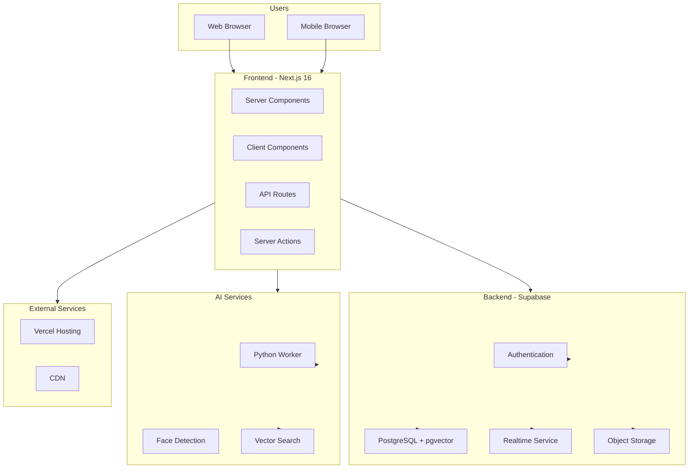

### Technology Stack Layers

```mermaid
graph LR
    subgraph Presentation["Presentation Layer"]
        React[React 19]
        NextJS[Next.js 16]
        R3F[React Three Fiber]
    end
    
    subgraph State["State Management"]
        Zustand[Zustand 5]
        ReactQuery[React Query 5]
    end
    
    subgraph Business["Business Logic"]
        Services[lib/services/]
        Hooks[Custom Hooks]
        Actions[Server Actions]
    end
    
    subgraph Data["Data Layer"]
        Supabase[Supabase]
        PostgreSQL[PostgreSQL 15]
        pgvector[pgvector]
    end
    
    Presentation --> State
    State --> Business
    Business --> Data
```

---

## Component Hierarchy

### Component Tree

```mermaid
graph TD
    subgraph Root["Root Layout"]
        app/layout.tsx
    end
    
    subgraph Providers["Providers"]
        QueryProvider[QueryProvider]
        ThemeProvider[ThemeProvider]
        SmoothScroll[SmoothScrollProvider]
    end
    
    subgraph Routes["Route Groups"]
        Public["(public)/ - Marketing & Auth"]
        Protected["(auth)/ - Dashboard & Features"]
    end
    
    subgraph Features["Feature Components"]
        Dashboard[dashboard/]
        Matches[matches/]
        Messages[messages/]
        Profile[profile/]
        Onboarding[onboarding/]
        Settings[settings/]
        Analytics[analytics/]
        Assistant[assistant/]
        Connections[connections/]
        Landing[landing/]
        Notifications[notifications/]
        Search[search/]
        AI-Mentor[ai-mentor/]
        Auth[auth/]
        Moderation[moderation/]
        Posts[posts/]
        Requests[requests/]
    end
    
    subgraph Shared["Shared Components"]
        SidebarNav[sidebar-nav.tsx]
        MobileNav[mobile-nav.tsx]
        GlassCard[glass-card.tsx]
        UserNav[user-nav-dropdown.tsx]
        MatchScore[match-score.tsx]
    end
    
    subgraph UI["UI Primitives (shadcn/ui)"]
        Button[button.tsx]
        Input[input.tsx]
        Card[card.tsx]
        Dialog[dialog.tsx]
        Avatar[avatar.tsx]
    end
    
    app/layout.tsx --> Providers
    Providers --> Routes
    Routes --> Features
    Features --> Shared
    Shared --> UI
```

### Feature Component Structure

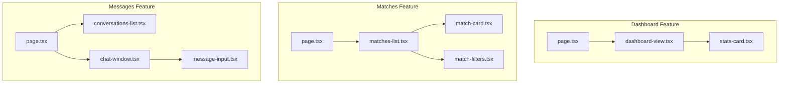

---

## Data Flow Diagrams

### Authentication Flow

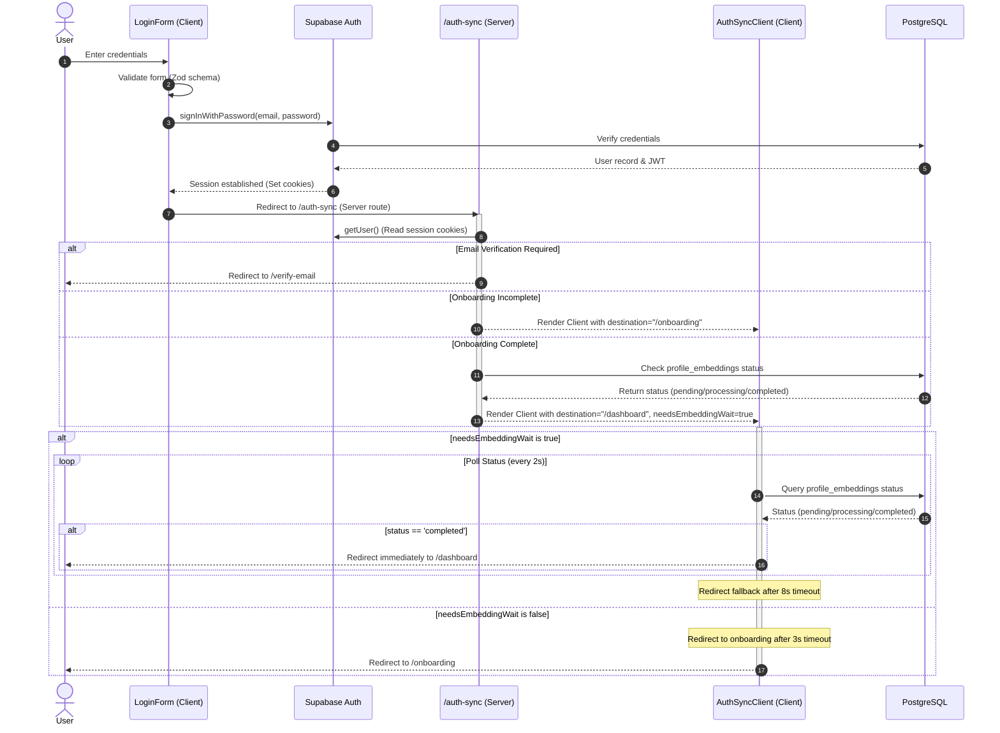

### Post Creation Flow

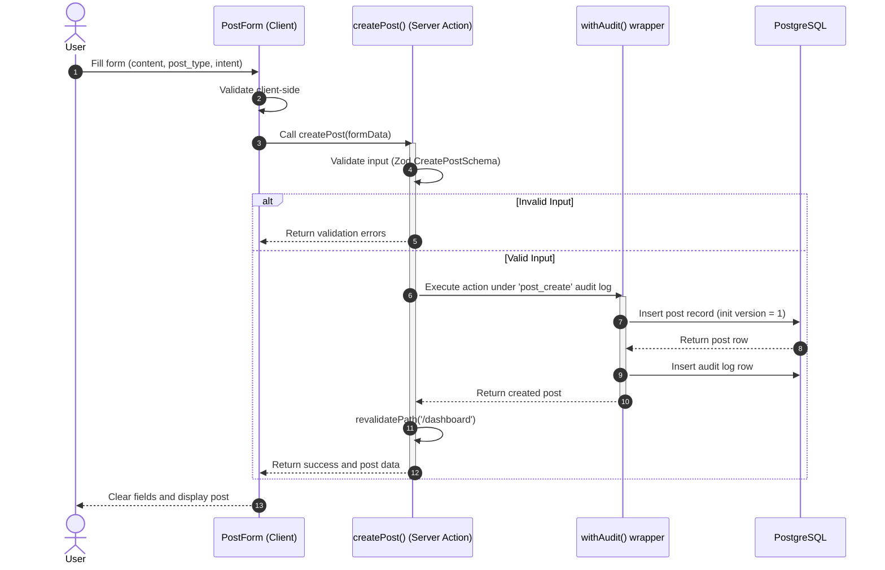

### Matching Algorithm Flow

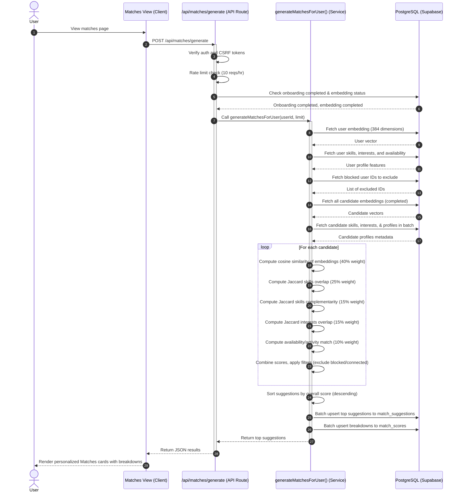

### Embedding Pipeline

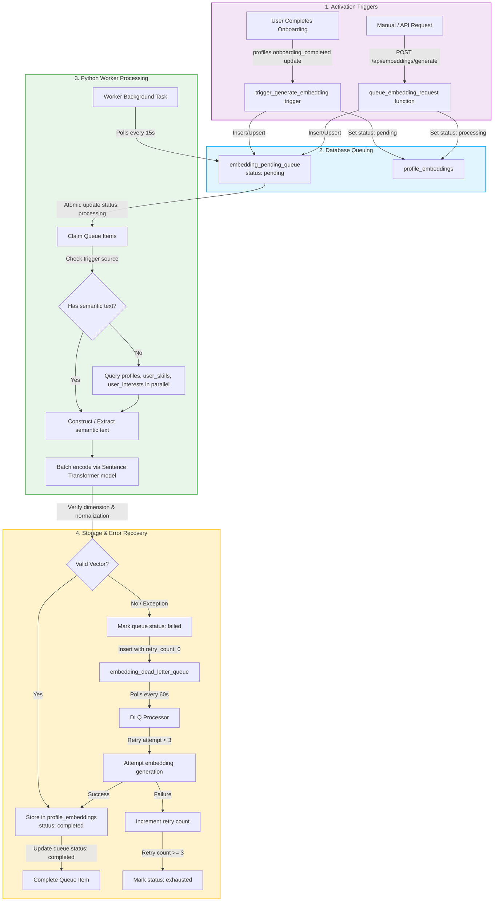

### Real-time Message Flow

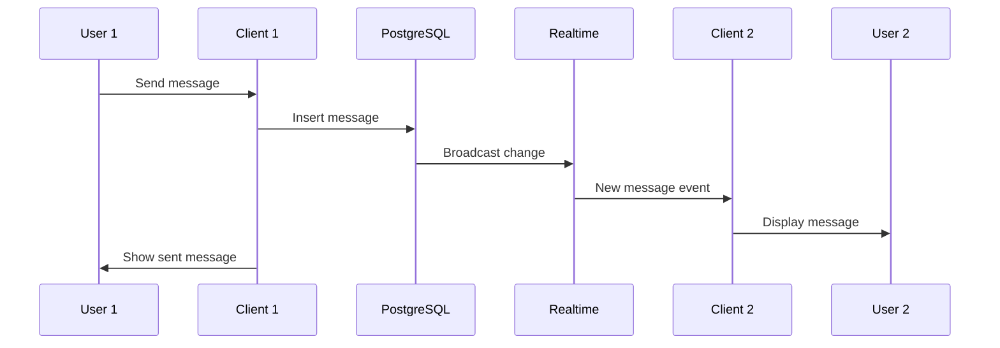

---

## Database Relationships

### Entity Relationship Diagram

```mermaid
erDiagram
    profiles ||--o{ user_skills: has
    profiles ||--o{ user_interests: has
    profiles ||--o{ user_experiences: has
    profiles ||--o{ user_projects: has
    profiles ||--|| profile_embeddings: has
    profiles ||--o{ posts: creates
    profiles ||--o{ comments: creates
    profiles ||--o{ connections: initiates
    profiles ||--o{ conversations: participates
    profiles ||--o{ messages: sends
    profiles ||--o{ notifications: receives
    profiles ||--o{ ai_mentor_sessions: has
    profiles ||--o{ feed_scores: scored
    profiles ||--o{ events: generates
    profiles ||--o{ privacy_settings: configures
    profiles ||--o{ theme_preferences: configures
    profiles ||--o{ audit_logs: logs
    profiles ||--o{ match_preferences: configures
    profiles ||--o{ embedding_rate_limits: "rate limited"
    profiles ||--o{ blocked_users: blocks
    profiles ||--o{ profile_visits: viewer
    profiles ||--o{ profile_visits: viewed
    profiles ||--o{ user_bookmarks: bookmarks
    
    posts ||--o{ post_attachments: has
    posts ||--o{ post_reactions: receives
    posts ||--o{ comments: contains
    posts ||--o{ feed_scores: "scored in"
    posts ||--o{ feed_thompson_params: tracks
    posts ||--o{ post_impressions: has
    posts ||--o{ user_bookmarks: "referenced in"
    
    comments ||--o{ comment_likes: receives
    comments ||--o{ comments: "replies (parent_id)"
    
    connections }|--|| profiles : requester
    connections }|--|| profiles : receiver
    blocked_users }|--|| profiles : blocker
    blocked_users }|--|| profiles : blocked
    
    conversations ||--o{ messages: contains
    ai_mentor_sessions ||--o{ ai_mentor_messages: contains
    
    profile_embeddings ||--|| profiles : belongs_to
    embedding_dead_letter_queue ||--|| profiles : retry_for
    embedding_pending_queue ||--|| profiles : queued_for
```

### Table Dependencies

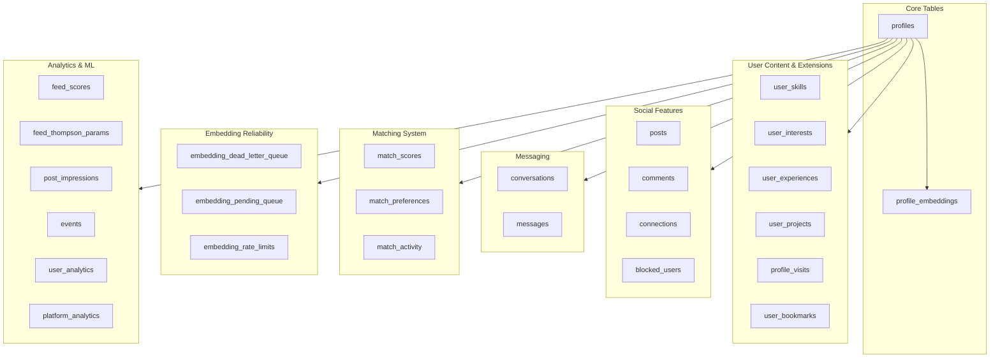

---

## Deployment Architecture

### Production Infrastructure

```mermaid
graph TB
    subgraph Users["Users"]
        User[Browser Client]
    end

    subgraph Vercel["Vercel Platform"]
        Edge[Edge Network]
        SSR[Serverless Functions]
        ISR[Incremental Static Regeneration]
    end
    
    subgraph Supabase["Supabase Cloud"]
        DB[PostgreSQL + pgvector]
        Storage[Object Storage]
        Realtime[Realtime Service]
        Auth[Supabase Auth]
    end
    
    subgraph Worker["Python Worker (Railway)"]
        API[FastAPI Server]
        Queue[Queue Processor]
        Model[Sentence Transformers]
    end
    
    subgraph CDN["Content Delivery"]
        ImageCDN[Image CDN]
        Static[Static Assets]
    end
    
    User --> Edge
    Edge --> SSR
    Edge --> ISR
    
    SSR --> Auth
    SSR --> DB
    SSR --> Storage
    SSR --> API : "HTTP POST (manual queueing)"
    
    API --> DB : "Insert pending item"
    Queue --> DB : "Poll pending queue & read profiles"
    Queue --> Model : "Generate vectors"
    Queue --> DB : "Upsert completed embedding"
    
    ISR --> ImageCDN
    ISR --> Static
```

### Environment Flow

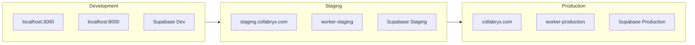

---

## Security Architecture

### Security Layers

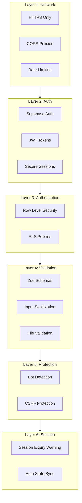

### RLS Policy Flow

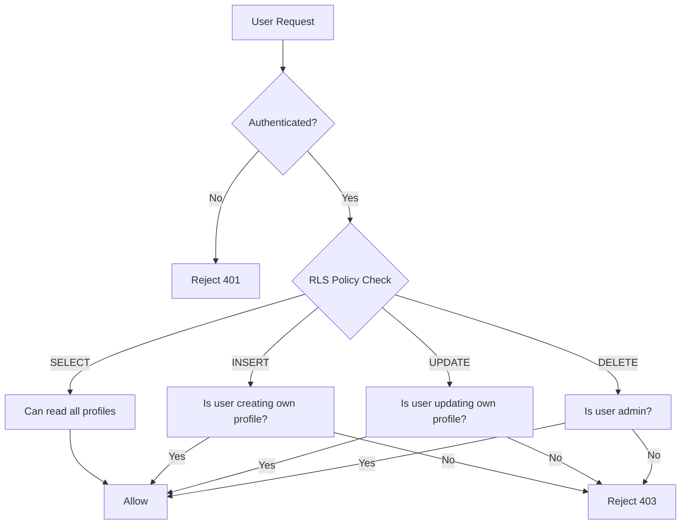

---

## Related Documentation

- [Architecture Overview](./overview.md) - Detailed architecture documentation
- [Deployment Guide](../05-deployment/overview.md) - Deployment instructions
- [API Reference](../03-core-features/api-reference.md) - All API endpoints
- [Security Guide](../SECURITY.md) - Security features

---

**Document Version:** 1.2.0  
**Last Reviewed:** 2026-06-05  
**Maintained By:** Architecture Team
