# Architecture Overview

**Last Updated:** 2026-03-16  
**Version:** 1.0.0

Comprehensive architecture documentation for Collabryx - a next-generation collaborative platform with AI-powered features.

---

## Table of Contents

- [System Design](#system-design)
- [Component Architecture](#component-architecture)
- [Data Flow](#data-flow)
- [Database Schema](#database-schema)
- [Security Architecture](#security-architecture)
- [Deployment Architecture](#deployment-architecture)

---

## System Design

Collabryx follows a modern, scalable architecture built on Next.js 16 App Router with Supabase backend services.

### High-Level Architecture

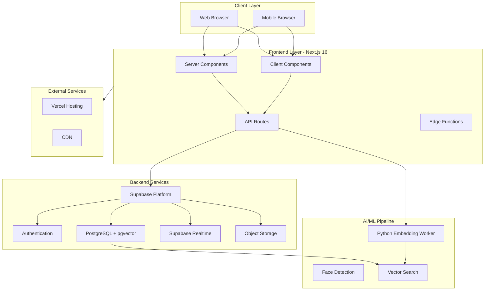

### Frontend Architecture (Next.js 16 App Router)

**Key Principles:**
- Server-first approach with selective client-side interactivity
- Streaming and Suspense for progressive loading
- React Query for server state management
- Zustand for client state

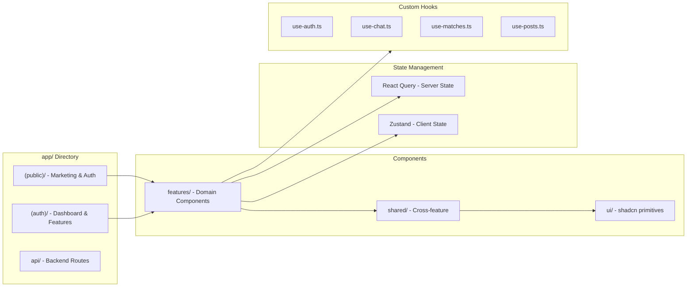

**Directory Structure:**
```
app/
├── (public)/           # Public routes (no auth required)
│   ├── landing/        # Landing page
│   ├── login/          # Login page
│   ├── register/       # Registration page
│   └── auth-sync/      # Auth synchronization
├── (auth)/             # Protected routes (auth required)
│   ├── dashboard/      # Main dashboard
│   ├── matches/        # AI matching
│   ├── messages/       # Real-time messaging
│   ├── my-profile/     # User profile
│   ├── onboarding/     # Onboarding flow
│   └── settings/       # User settings
└── api/                # API endpoints
    ├── auth/           # Authentication
    ├── chat/           # AI chat
    ├── embeddings/     # Embedding generation
    └── posts/          # Post operations
```

### Backend Architecture (Supabase)

**Core Services:**

| Service | Purpose | Technology |
|---------|---------|------------|
| **Authentication** | User auth & sessions | Supabase Auth (PostgreSQL) |
| **Database** | Primary data store | PostgreSQL 15 + pgvector |
| **Realtime** | Live subscriptions | Supabase Realtime (WebSockets) |
| **Storage** | File uploads | Supabase Storage (S3-compatible) |
| **Edge Functions** | Server-side logic | Deno runtime |

**Row Level Security (RLS):**
All tables have RLS policies enforcing:
- Users can only read/write their own data
- Connected users can share specific data
- Public data (posts) has read access for all authenticated users

### AI/ML Pipeline (Python Worker)

The embedding generation system runs as a separate Python service:

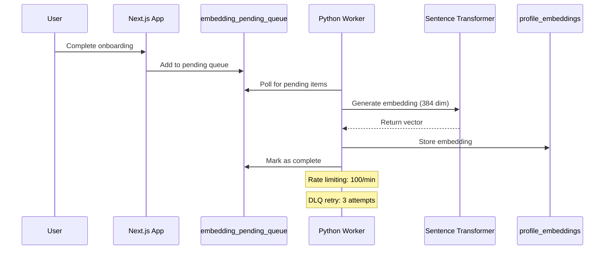

**Components:**
- **Embedding Generator:** `python-worker/embedding_generator.py`
- **Rate Limiter:** `python-worker/rate_limiter.py`
- **Validator:** `python-worker/embedding_validator.py`
- **Dead Letter Queue:** Failed embeddings retry automatically

**Model:** `all-MiniLM-L6-v2` (384 dimensions, CPU-optimized)

### 3D Visualization Layer

Built on Three.js ecosystem for immersive experiences:

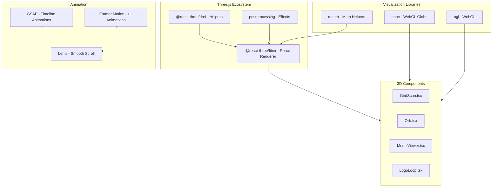

---

## Component Architecture

### Component Hierarchy

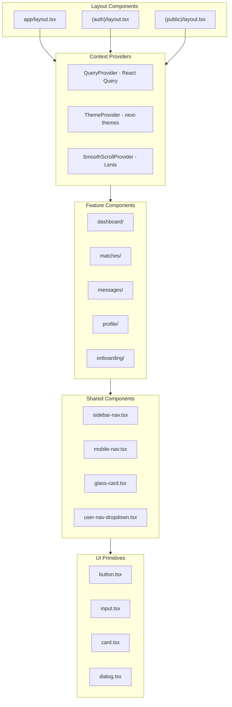

### Component Patterns

**Server Components (Default):**
```tsx
// app/(auth)/dashboard/page.tsx
import { createServerClient } from '@/lib/supabase/server'
import { DashboardView } from '@/components/features/dashboard/dashboard-view'

export default async function DashboardPage() {
  const supabase = createServerClient()
  const { data: posts } = await supabase
    .from('posts')
    .select('*, profiles(*)')
  
  return <DashboardView initialPosts={posts} />
}
```

**Client Components (with "use client"):**
```tsx
// components/features/dashboard/dashboard-view.tsx
'use client'

import { usePosts } from '@/hooks/use-posts'
import { PostCard } from './post-card'

export function DashboardView({ initialPosts }: { initialPosts: Post[] }) {
  const { data: posts } = usePosts(initialPosts)
  
  return (
    <div className="grid gap-4">
      {posts?.map(post => (
        <PostCard key={post.id} post={post} />
      ))}
    </div>
  )
}
```

---

## Data Flow

### Authentication Flow

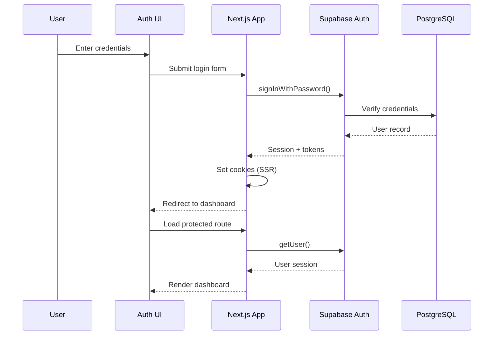

**Key Files:**
- Login: `app/(public)/login/page.tsx`
- Auth callback: `app/api/auth/callback/route.ts`
- Auth hook: `hooks/use-auth.ts`
- Server client: `lib/supabase/server.ts`

### Post Creation Flow

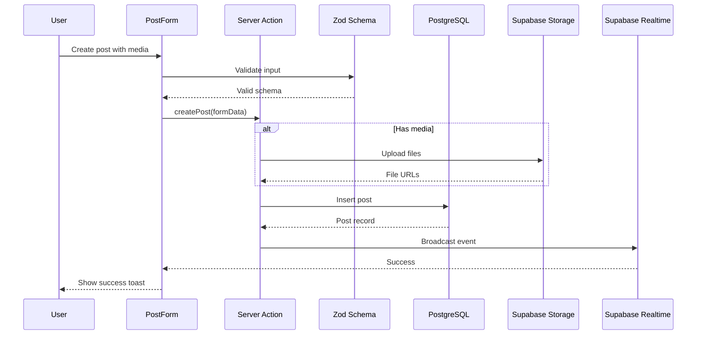

**Key Files:**
- Form: `components/features/post/post-form.tsx`
- Server action: `components/features/post/actions.ts`
- Validation: `lib/validations/post.ts`
- Hook: `hooks/use-posts.ts`

### Matching Algorithm Flow

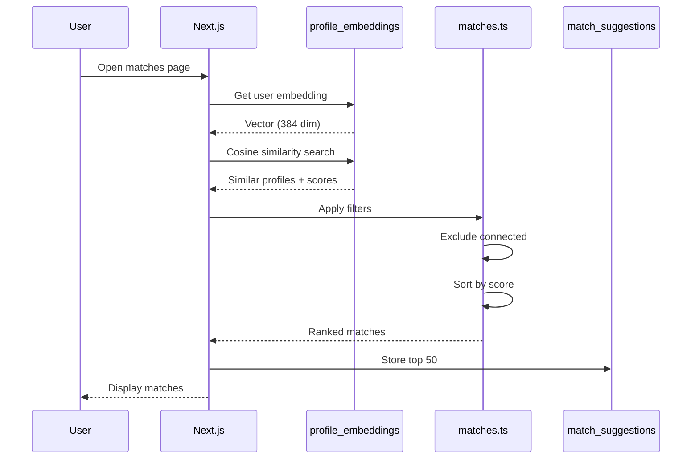

**Matching Criteria:**
1. **Semantic Similarity (60%)** - Vector embedding cosine similarity
2. **Skill Overlap (20%)** - Common skills count
3. **Interest Alignment (15%)** - Shared interests
4. **Activity Level (5%)** - Recent engagement

### Embedding Pipeline

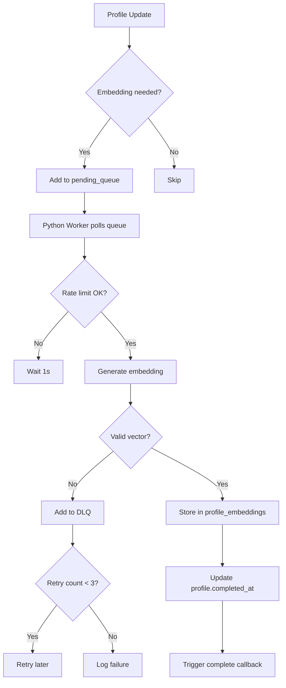

**Reliability Features:**
- **Rate Limiting:** 100 embeddings/minute
- **Dead Letter Queue:** 3 retry attempts
- **Validation:** Vector dimension check (384)
- **Monitoring:** Health endpoint at `:8000/health`

---

## Database Schema

### Entity Relationship Diagram

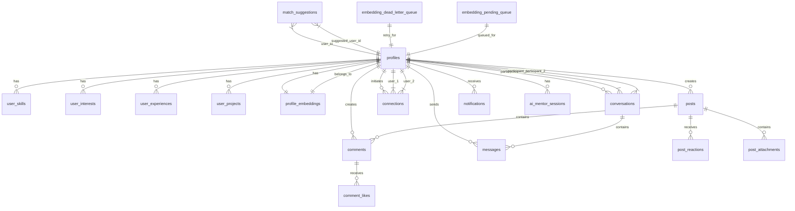

### Core Tables

| Table | Columns | Purpose |
|-------|---------|---------|
| **profiles** | 25 columns | User profiles with completion tracking |
| **user_skills** | 6 columns | User skills (normalized) |
| **user_interests** | 6 columns | User interests (normalized) |
| **user_experiences** | 10 columns | Work experience history |
| **user_projects** | 10 columns | Project portfolio |
| **posts** | 12 columns | Social posts |
| **comments** | 9 columns | Post comments |
| **connections** | 7 columns | User connections (bidirectional) |
| **match_suggestions** | 9 columns | AI-generated match suggestions |
| **conversations** | 8 columns | Chat conversations |
| **messages** | 10 columns | Chat messages |
| **notifications** | 11 columns | User notifications |
| **profile_embeddings** | 5 columns | Vector embeddings (384 dim) |
| **embedding_dead_letter_queue** | 8 columns | Failed embedding retries |
| **embedding_pending_queue** | 7 columns | Onboarding embedding queue |

### Indexes & Performance

**Vector Search:**
```sql
CREATE INDEX profile_embeddings_vector_idx 
ON profile_embeddings 
USING hnsw (embedding vector_cosine_ops)
WITH (m = 16, ef_construction = 64);
```

**Common Queries:**
```sql
-- Get user's matches (optimized)
SELECT p.*, pe.embedding 
FROM profiles p
JOIN profile_embeddings pe ON p.id = pe.profile_id
WHERE p.id != $user_id
ORDER BY pe.embedding <=> $user_embedding
LIMIT 50;

-- Get conversation messages (real-time)
SELECT m.*, p.avatar_url, p.display_name
FROM messages m
JOIN profiles p ON m.sender_id = p.id
WHERE m.conversation_id = $conv_id
ORDER BY m.created_at ASC;
```

---

## Security Architecture

### Security Layers

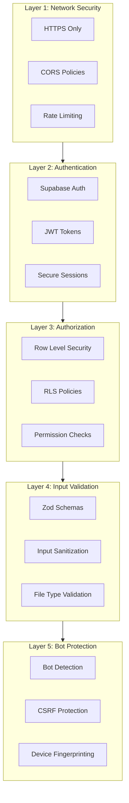

### Row Level Security (RLS)

**Example Policy (profiles table):**
```sql
-- Users can read all profiles
CREATE POLICY "Public profiles are viewable by everyone"
ON profiles FOR SELECT
USING (true);

-- Users can only update their own profile
CREATE POLICY "Users can update own profile"
ON profiles FOR UPDATE
USING (auth.uid() = id);

-- Users can only insert their own profile
CREATE POLICY "Users can insert own profile"
ON profiles FOR INSERT
WITH CHECK (auth.uid() = id);
```

### Rate Limiting

| Endpoint | Limit | Window |
|----------|-------|--------|
| General API | 100 requests | 15 minutes |
| Auth endpoints | 10 requests | 1 minute |
| Embedding generation | 100 requests | 1 minute |
| File uploads | 10 uploads | 1 minute |

### CSRF Protection

```typescript
// lib/csrf.ts
export function generateCSRFToken(): string {
  return crypto.randomUUID()
}

export function validateCSRFToken(token: string, sessionToken: string): boolean {
  return token === sessionToken
}
```

### Bot Detection

```typescript
// lib/bot-detection.ts
export function detectBot(request: Request): boolean {
  const userAgent = request.headers.get('user-agent') || ''
  const suspiciousPatterns = [
    /bot/i,
    /crawler/i,
    /spider/i,
    /headless/i
  ]
  
  return suspiciousPatterns.some(pattern => pattern.test(userAgent))
}
```

---

## Deployment Architecture

### Production Infrastructure

```mermaid
graph TB
    subgraph Vercel["Vercel Platform"]
        Edge[Edge Network]
        SSR[Serverless Functions]
        ISR[Incremental Static Regeneration]
    end
    
    subgraph Supabase["Supabase Cloud"]
        Primary[Primary DB (US-East)]
        Replica[Read Replica (EU-West)]
        Storage[Object Storage]
        Realtime[Realtime Service]
    end
    
    subgraph Worker["Python Worker (Render/Railway)"]
        Container[Docker Container]
        Health[Health Check]
        Queue[Queue Processor]
    end
    
    subgraph CDN["Content Delivery"]
        Images[Image CDN]
        Static[Static Assets]
    end
    
    User --> Edge
    Edge --> SSR
    Edge --> ISR
    SSR --> Supabase
    ISR --> Supabase
    Supabase --> Primary
    Supabase --> Replica
    SSR --> Worker
    ISR --> CDN
```

### Environment Configuration

**Vercel Environment Variables:**
```env
# Supabase
NEXT_PUBLIC_SUPABASE_URL=https://xxx.supabase.co
NEXT_PUBLIC_SUPABASE_ANON_KEY=eyJhbG...
SUPABASE_SERVICE_ROLE_KEY=eyJhbG...

# Python Worker
PYTHON_WORKER_URL=https://worker.railway.app

# Application
NEXT_PUBLIC_APP_URL=https://collabryx.com
NODE_ENV=production
```

**Python Worker Environment:**
```env
SUPABASE_URL=https://xxx.supabase.co
SUPABASE_SERVICE_ROLE_KEY=eyJhbG...
ALLOWED_ORIGINS=https://collabryx.com
```

### Monitoring & Observability

**Health Checks:**
- Frontend: Vercel Analytics
- Database: Supabase Dashboard
- Worker: `/health` endpoint
- Realtime: Connection monitoring

**Alerts:**
- Embedding queue depth > 100
- DLQ exhaustion (retry limit reached)
- API error rate > 5%
- Response time > 2s

---

## Related Documentation

- [Deployment Guide](./DEPLOYMENT.md) - Complete deployment instructions
- [API Reference](./API-REFERENCE.md) - All API endpoints
- [Security Guide](./SECURITY.md) - Security features overview
- [Development Guide](./01-getting-started/development.md) - Local development setup

---

**Document Version:** 1.0.0  
**Last Reviewed:** 2026-03-16  
**Maintained By:** Development Team
