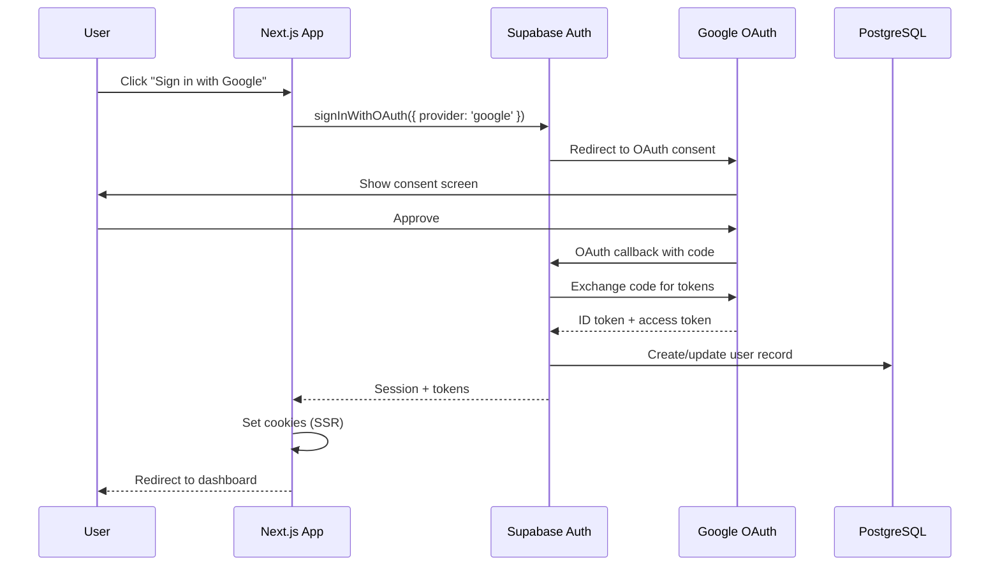
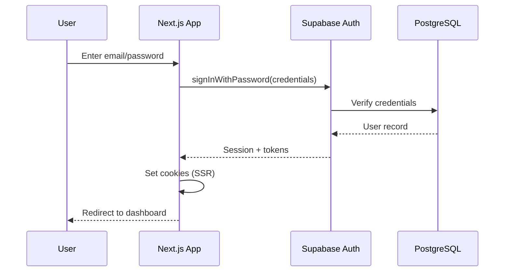

# Authentication Flow Documentation

**Last Updated:** 2026-03-20  
**Version:** 2.0.0

---

## Overview

Collabryx uses Supabase Auth with OAuth (Google) and email/password authentication. This document covers the complete authentication flow from login to session management.

---

## Authentication Methods

### 1. OAuth (Google) - Primary Method

**Flow:**


**Implementation:**
```typescript
// app/(public)/login/page.tsx
const handleGoogleLogin = async () => {
  const { error } = await supabase.auth.signInWithOAuth({
    provider: 'google',
    options: {
      redirectTo: `${window.location.origin}/api/auth/callback`,
      queryParams: {
        access_type: 'offline',
        prompt: 'consent',
      },
    },
  })
  
  if (error) {
    toast.error('Failed to sign in with Google')
  }
}
```

**Callback Handler:**
```typescript
// app/api/auth/callback/route.ts
export async function GET(request: NextRequest) {
  const requestUrl = new URL(request.url)
  const code = requestUrl.searchParams.get('code')
  
  if (code) {
    const supabase = createClient()
    await supabase.auth.exchangeCodeForSession(code)
    
    // Redirect to dashboard
    return NextResponse.redirect(new URL('/dashboard', requestUrl.origin))
  }
  
  return NextResponse.redirect(new URL('/login?error=auth_failed', requestUrl.origin))
}
```

### 2. Email/Password - Secondary Method

**Flow:**


**Implementation:**
```typescript
// components/features/auth/login-form.tsx
const handleSubmit = async (data: FormData) => {
  const { error } = await supabase.auth.signInWithPassword({
    email: data.get('email') as string,
    password: data.get('password') as string,
  })
  
  if (error) {
    if (error.code === 'invalid_credentials') {
      toast.error('Invalid email or password')
    } else {
      toast.error('Sign in failed')
    }
  }
}
```

---

## Session Management

### Server-Side Sessions

**Cookie-Based Sessions:**
```typescript
// lib/supabase/server.ts
export function createServerClient() {
  return createServerClient(
    process.env.NEXT_PUBLIC_SUPABASE_URL!,
    process.env.NEXT_PUBLIC_SUPABASE_ANON_KEY!,
    {
      cookies: {
        async getAll() {
          return (await cookies()).getAll()
        },
        async setAll(cookiesToSet) {
          const cookieStore = await cookies()
          cookiesToSet.forEach(({ name, value, options }) => {
            cookieStore.set(name, value, options)
          })
        },
      },
    }
  )
}
```

### Client-Side Sessions

```typescript
// lib/supabase/client.ts
export function createBrowserClient() {
  return createBrowserClient(
    process.env.NEXT_PUBLIC_SUPABASE_URL!,
    process.env.NEXT_PUBLIC_SUPABASE_ANON_KEY!
  )
}
```

### Session Persistence

- **Access Token:** 1 hour (default)
- **Refresh Token:** 30 days (configurable)
- **Cookie:** HttpOnly, Secure (production), SameSite=Strict

---

## Protected Routes

### Route Groups

```
app/
├── (public)/          # No auth required
│   ├── landing/
│   ├── login/
│   └── register/
└── (auth)/            # Auth required
    ├── dashboard/
    ├── matches/
    ├── messages/
    └── my-profile/
```

### Middleware Protection

```typescript
// middleware.ts
export async function middleware(request: NextRequest) {
  const supabase = createMiddlewareClient(request, response)
  const { data: { session } } = await supabase.auth.getSession()
  
  // Protected routes
  if (request.nextUrl.pathname.startsWith('/(auth)') && !session) {
    return NextResponse.redirect(new URL('/login', request.url))
  }
  
  // Auth routes redirect to dashboard if already logged in
  if (request.nextUrl.pathname.startsWith('/(public)/login') && session) {
    return NextResponse.redirect(new URL('/dashboard', request.url))
  }
  
  return response
}
```

---

## Auth Hook

```typescript
// hooks/use-auth.ts
export function useAuth() {
  const [user, setUser] = useState<User | null>(null)
  const [loading, setLoading] = useState(true)
  
  useEffect(() => {
    // Get initial session
    supabase.auth.getSession().then(({ data: { session } }) => {
      setUser(session?.user ?? null)
      setLoading(false)
    })
    
    // Listen for auth changes
    const { data: { subscription } } = supabase.auth.onAuthStateChange(
      (event, session) => {
        setUser(session?.user ?? null)
      }
    )
    
    return () => subscription.unsubscribe()
  }, [])
  
  const signOut = async () => {
    await supabase.auth.signOut()
    setUser(null)
  }
  
  return { user, loading, signOut }
}
```

---

## Security Features

### CSRF Protection

```typescript
// lib/csrf.ts
export async function validateCSRFRequest(
  requestToken: string | null,
  cookieToken: string | null
): Promise<boolean> {
  if (!requestToken || !cookieToken) return false
  
  const [hashedRequest, hashedCookie] = await Promise.all([
    hashToken(requestToken),
    hashToken(cookieToken)
  ])
  
  return hashedRequest === hashedCookie || requestToken === cookieToken
}
```

### Rate Limiting

| Endpoint | Limit | Window |
|----------|-------|--------|
| Login | 5 requests | 15 minutes |
| Registration | 3 requests | 1 hour |
| Password Reset | 3 requests | 1 hour |
| OAuth | 10 requests | 1 minute |

### Bot Detection

```typescript
// lib/bot-detection.ts
export function checkBot(request: NextRequest): BotCheckResult {
  const userAgent = request.headers.get('user-agent') || ''
  
  // Check for bot patterns
  const isBot = KNOWN_BOT_PATTERNS.some(p => p.test(userAgent))
  const isSafeBot = SAFE_BOT_PATTERNS.some(p => p.test(userAgent))
  
  return {
    isBot,
    isSafeBot,
    score: calculateBotScore(request),
    reason: 'Bot detection result'
  }
}
```

---

## Error Handling

### Error Codes

| Code | Message | Resolution |
|------|---------|------------|
| `invalid_credentials` | Invalid email or password | Check credentials |
| `email_not_confirmed` | Email not confirmed | Resend confirmation |
| `weak_password` | Password too weak | Use stronger password |
| `user_already_exists` | Email already registered | Use different email |
| `user_not_found` | User doesn't exist | Register first |
| `session_expired` | Session expired | Re-authenticate |

### Error Boundaries

```typescript
// app/(auth)/error.tsx
'use client'

export default function AuthError({ error, reset }: { error: Error, reset: () => void }) {
  return (
    <GlassCard>
      <h2>Authentication Error</h2>
      <p>{error.message}</p>
      <Button onClick={reset}>Try Again</Button>
    </GlassCard>
  )
}
```

---

## Testing

```typescript
// tests/unit/hooks/use-auth.test.tsx
describe('useAuth hook', () => {
  it('should return user when authenticated', async () => {
    renderHook(() => useAuth())
    
    // Mock authenticated session
    await waitFor(() => {
      expect(result.current.user).toBeDefined()
    })
  })
  
  it('should return null when not authenticated', async () => {
    // Mock unauthenticated session
    renderHook(() => useAuth())
    
    await waitFor(() => {
      expect(result.current.user).toBeNull()
    })
  })
})
```

---

## Related Documentation

- [API Reference](./API-REFERENCE.md) - Auth endpoints
- [Security Guide](./SECURITY.md) - Security features
- [Session Configuration](./07-reference/session-config.md) - Session settings

---

**Document Version:** 2.0.0  
**Last Reviewed:** 2026-03-20  
**Maintained By:** Backend Team
