# Collabryx Conceptual High-Level Diagrams

**Document Purpose:** High-level conceptual diagrams for Collabryx platform understanding
**Target Audience:** Stakeholders, researchers, product teams

---

## 1. System Context Diagram (C4-Style Container View)

```mermaid
%%{init: { 'theme': 'base', 'themeVariables': { 'fontFamily': 'Inter, sans-serif', 'primaryColor': '#2563EB', 'primaryTextColor': '#1E40AF', 'primaryBorderColor': '#3B82F6', 'lineColor': '#64748B', 'secondaryColor': '#10B981', 'tertiaryColor': '#F59E0B' } } }%%
graph TB
    %% External Actors
    subgraph External_Actors["External Actors"]
        direction TB
        Student["👤 Student<br/><small>University student seeking<br/>connections & opportunities</small>"]
        FreshGraduate["🎓 Fresh Graduate<br/><small>Early-career professional<br/>seeking mentorship & jobs</small>"]
        Employer["🏢 Employer<br/><small>Company posting opportunities<br/>& seeking candidates</small>"]
    end

    %% Collabryx Platform Container
    subgraph Collabryx_Platform["Collabryx Platform"]
        direction TB
        WebApp["🌐 Web Application<br/><small>Next.js 16 • React 19 • TypeScript</small>"]
        API["⚡ API Layer<br/><small>RESTful Endpoints • Edge Functions</small>"]

        subgraph Core_Services["Core Platform Services"]
            direction LR
            Auth["🔐 Authentication<br/><small>Supabase Auth • JWT</small>"]
            Profile["👤 Profile Management<br/><small>Skills • Interests • Goals</small>"]
            Matching["🤖 AI Matching Engine<br/><small>Vector Embeddings • pgvector</small>"]
            Messaging["💬 Real-time Messaging<br/><small>Supabase Realtime</small>"]
            AI_Mentor["🧠 AI Mentor<br/><small>Gemini-powered Assistant</small>"]
        end

        subgraph Data_Store["Data Layer"]
            direction LR
            PostgreSQL["🗄️ PostgreSQL + pgvector<br/><small>31 Tables • 100 RLS Policies</small>"]
            Cache["⚡ Caching Layer<br/><small>Match Results • Sessions</small>"]
        end
    end

    subgraph External_Services["External Services"]
        AI_Services["🤖 AI Services<br/><small>Sentence Transformers • Gemini</small>"]
        ContentMod["🛡️ Content Moderation<br/><small>Perspective API • HuggingFace</small>"]
    end

    %% Connections from Actors to Platform
    Student -->|"1. Register/Login"| WebApp
    Student -->|"2. Build Profile"| Profile
    Student -->|"3. View Matches"| Matching
    Student -->|"4. Connect & Message"| Messaging
    Student -->|"5. Ask AI Mentor"| AI_Mentor

    FreshGraduate -->|"1. Register/Login"| WebApp
    FreshGraduate -->|"2. Build Profile"| Profile
    FreshGraduate -->|"3. View Matches"| Matching
    FreshGraduate -->|"4. Connect & Message"| Messaging
    FreshGraduate -->|"5. Ask AI Mentor"| AI_Mentor

    Employer -->|"Post Opportunities"| WebApp

    %% Internal Platform Flows
    WebApp <-->|"Auth & Data"| Auth
    Profile -->|"Store & Retrieve"| PostgreSQL
    Matching -->|"Vector Similarity Search"| PostgreSQL
    Matching <-->|"Generate Embeddings"| AI_Services
    Messaging -->|"Store Messages"| PostgreSQL
    AI_Mentor -->|"Process Requests"| AI_Services
    AI_Mentor -->|"Validate Content"| ContentMod

    API -->|"Orchestrate"| Core_Services
    API -->|"Query"| Data_Store

    %% Styling
    style Student fill:#DBEAFE,stroke:#3B82F6,stroke-width:2px
    style FreshGraduate fill:#D1FAE5,stroke:#10B981,stroke-width:2px
    style Employer fill:#FEF3C7,stroke:#F59E0B,stroke-width:2px
    style Collabryx_Platform fill:#F8FAFC,stroke:#1E40AF,stroke-width:3px
    style WebApp fill:#EFF6FF,stroke:#2563EB,stroke-width:1px
    style AI_Services fill:#F0FDF4,stroke:#16A34A,stroke-width:1px
    style ContentMod fill:#FEF2F2,stroke:#DC2626,stroke-width:1px
```



**Diagram 1 Legend:**
- 🔵 **Blue boxes** = Primary user actors (Students, Fresh Graduates)
- 🟢 **Green boxes** = Graduate actors
- 🟡 **Yellow boxes** = Employer actors
- ⚪ **Gray container** = Collabryx Platform boundary
- 🔷 **Light blue** = Web-facing components
- 🌿 **Green** = AI Services
- 🔴 **Red** = Content moderation

---

## 2. Core Value Proposition Flow

*How AI-driven connections are made between students/fresh graduates and relevant opportunities/peers*

```mermaid
%%{init: { 'theme': 'base', 'themeVariables': { 'fontFamily': 'Inter, sans-serif', 'primaryColor': '#2563EB', 'primaryTextColor': '#1E40AF', 'primaryBorderColor': '#3B82F6', 'lineColor': '#64748B', 'secondaryColor': '#10B981', 'tertiaryColor': '#F59E0B' } } }%%
flowchart TD
    %% Start - User Profile Creation
    Start(["🎯 User Creates Profile<br/><small>Skills, Interests, Goals, Bio</small>"])

    %% Profile to Semantic Text
    Start --> BuildText["📝 Build Semantic Profile Text<br/><small>'Student Developer seeking fintech<br/>passionate about AI and finance'</small>"]

    BuildText --> GenerateEmbedding["🔄 Generate Vector Embedding<br/><small>Sentence Transformers<br/>all-MiniLM-L6-v2 (384 dimensions)</small>"]

    GenerateEmbedding --> StoreEmbedding["💾 Store in PostgreSQL<br/><small>profile_embeddings table<br/>pgvector extension</small>"]

    %% Matching Process
    StoreEmbedding --> MatchRequest["👤 User Requests Matches"]

    MatchRequest --> VectorSearch["🔍 Cosine Similarity Search<br/><small>Find profiles with similar<br/>vector embeddings</small>"]

    VectorSearch --> Scoring["📊 Multi-Factor Scoring"]

    subgraph Scoring_Engine["Scoring Engine (Weighted Average)"]
        direction LR
        Semantic["🤖 Semantic Score<br/><small weight:40%>Vector Cosine Similarity</small>"]
        Skills["🎯 Skills Match<br/><small weight:25%>Shared Skills Count</small>"]
        Interests["💡 Interests Alignment<br/><small weight:20%>Common Interests</small>"]
        Activity["⚡ Activity Level<br/><small weight:10%>Recent Engagement</small>"]
        Reciprocity["🔄 Reciprocity<br/><small weight:5%>Mutual Connection Likelihood</small>"]
    end

    Scoring --> Semantic
    Scoring --> Skills
    Scoring --> Interests
    Scoring --> Activity
    Scoring --> Reciprocity

    Semantic --> CombinedScore["📈 Combined Match Score"]
    Skills --> CombinedScore
    Interests --> CombinedScore
    Activity --> CombinedScore
    Reciprocity --> CombinedScore

    CombinedScore --> Filter["🔇 Apply Filters<br/><small>Exclude connected users<br/>Exclude blocked users</small>"]

    Filter --> Rank["🏆 Rank by Score<br/><small>Top 50 matches stored</small>"]

    Rank --> Present["✨ Present to User<br/><small>Match cards with scores<br/>common skills/interests</small>"]

    Present --> Action["What would you like to do?"]

    Action --> Connect["🤝 Send Connection Request"])
    Action --> Message["💬 Start Conversation")
    Action --> Save["⭐ Save for Later")
    Action --> Dismiss["👋 Dismiss")

    %% External Services Integration
    subgraph AI_Pipeline["AI/ML Pipeline"]
        direction TB
        EmbeddingWorker["🐍 Python Worker<br/><small>FastAPI • Queue Processor<br/>Rate Limited: 100/min</small>"]
        MentorAI["🧠 AI Mentor (Gemini)<br/><small>Career Guidance • Next Steps</small>"]
    end

    StoreEmbedding -.->|"Background Processing"| EmbeddingWorker
    MentorAI -.->|"On-demand"| Present

    %% Styling
    style Start fill:#DBEAFE,stroke:#3B82F6,stroke-width:3px
    style GenerateEmbedding fill:#FEF3C7,stroke:#F59E0B,stroke-width:2px
    style StoreEmbedding fill:#D1FAE5,stroke:#10B981,stroke-width:2px
    style VectorSearch fill:#FEF3C7,stroke:#F59E0B,stroke-width:2px
    style Scoring_Engine fill:#F5F3FF,stroke:#8B5CF6,stroke-width:2px
    style CombinedScore fill:#10B981,stroke:#059669,stroke-width:2px,color:#fff
    style Present fill:#DBEAFE,stroke:#2563EB,stroke-width:2px
    style Connect fill:#D1FAE5,stroke:#10B981,stroke-width:2px
    style Message fill:#D1FAE5,stroke:#10B981,stroke-width:2px
    style AI_Pipeline fill:#FCE7F3,stroke:#DB2777,stroke-width:2px,stroke-dasharray:5,5
```

**Diagram 2 Legend:**
- 🔵 **Blue flow** = Profile creation path
- 🟡 **Yellow flow** = Embedding/generation
- 🟢 **Green flow** = Matching & presentation
- 🟣 **Purple box** = Scoring engine breakdown
- 🔷 **Pink dashed** = AI pipeline integration
- **Scoring Weights:** Semantic (40%), Skills (25%), Interests (20%), Activity (10%), Reciprocity (5%)

---

## Appendix: Key Metrics

| Metric | Value |
|--------|-------|
| **Vector Dimensions** | 384 (all-MiniLM-L6-v2) |
| **Match Retrieval** | Top 50 ranked suggestions |
| **Semantic Weight** | 40% of total score |
| **Embedding Rate Limit** | 100/min (Python Worker) |
| **Min Match Threshold** | 0.5 cosine similarity |

---

*Generated: 2026-03-19 | Collabryx Documentation*