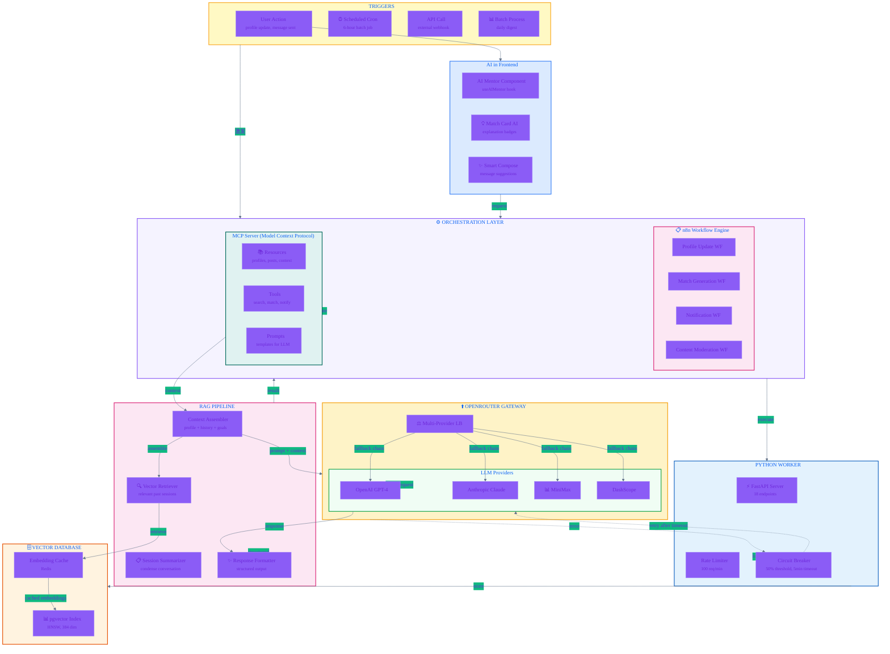
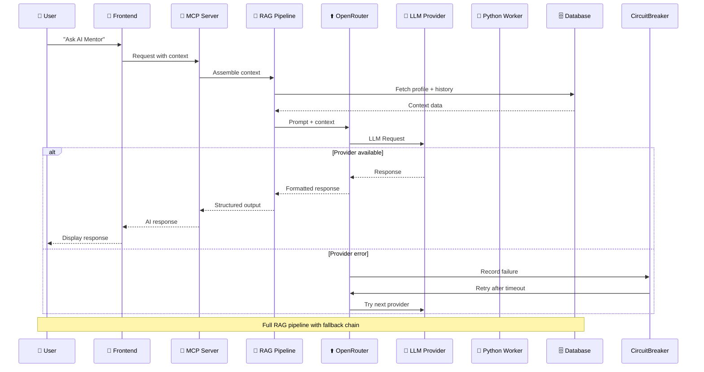

# System Architecture Diagrams

**Last Updated:** 2026-04-30
**Version:** 1.0.0
**Project:** Collabryx - AI-Powered Collaborative Platform

---

## Table of Contents

1. [High-Level System Architecture](#1-high-level-system-architecture)
2. [AI Orchestration Architecture](#2-ai-orchestration-architecture)

---

## 1. High-Level System Architecture

*Diagram breaking down the separation of concerns showing Next.js frontend communicating with backend APIs and database layer*

```mermaid
%%{init: { 'theme': 'base', 'themeVariables': { 'fontFamily': 'Inter, sans-serif', 'primaryColor': '#2563EB', 'primaryTextColor': '#1E40AF', 'primaryBorderColor': '#3B82F6', 'lineColor': '#64748B', 'secondaryColor': '#10B981', 'tertiaryColor': '#F59E0B' } } }%%
flowchart TB
    subgraph Client["🌐 CLIENT LAYER"]
        direction TB
        Browser["🖥️ Browser<br/><small>React 19 • Next.js 16</small>"]
        MobileApp["📱 Mobile Web<br/><small>Responsive PWA</small>"]
    end

    subgraph CDN["⚡ CDN & EDGE"]
        Cloudflare["☁️ Cloudflare CDN<br/><small>Edge Caching • DDoS Protection</small>"]
    end

    subgraph Frontend["🎨 FRONTEND - Next.js App Router"]
        direction TB
        subgraph Pages["📄 Route Pages"]
            PublicPages["(public)/<br/>landing, login, register"]
            AuthPages["(auth)/<br/>dashboard, messages, profile"]
            API Routes["api/ REST endpoints"]
        end

        subgraph Components["🧩 Components"]
            UIComponents["shadcn/ui Components"]
            FeatureComponents["features/* Components"]
            SharedComponents["shared/* Components"]
        end

        subgraph Hooks["⚓ React Hooks"]
            AuthHook["useAuth hook"]
            QueryHooks["React Query hooks"]
            Context["Auth & Theme Context"]
        end
    end

    subgraph Backend["⚙️ BACKEND SERVICES"]
        direction TB
        subgraph PythonWorker["🐍 Python Worker (FastAPI)"]
            WorkerMain["main.py<br/><small>18 endpoints</small>"]
            subgraph Services["🔧 Services"]
                EmbeddingService["embedding_service.py"]
                MatchService["match_generator.py"]
                NotificationService["notification_engine.py"]
                AIAnalysisService["ai_analysis_service.py"]
            end
            subgraph Models["🤖 ML Models"]
                SentenceTransformer["all-MiniLM-L6-v2<br/>384 dimensions"]
                Gemini["Gemini Pro"]
            end
        end

        subgraph ExternalAPI["🔌 External APIs"]
            OpenRouter["⬆️ OpenRouter<br/><small>Multi-LLM Gateway</small>"]
            PerspectiveAPI["🛡️ Perspective API<br/><small>Content Safety</small>"]
        end
    end

    subgraph Database["💾 DATA LAYER - Supabase"]
        direction TB
        subgraph PostgreSQL["🗄️ PostgreSQL 15 + pgvector"]
            CoreTables["profiles, posts, connections<br/>conversations, messages"]
            VectorTables["profile_embeddings<br/>match_suggestions"]
            AuthTables["auth.users<br/>profiles"]
        end
        subgraph Realtime["⚡ Supabase Realtime"]
            RealtimeSubs["Subscription channels<br/>for live updates"]
        end
        subgraph Storage["📦 Supabase Storage"]
            AvatarStorage["avatars/"]
            PostMedia["post-media/"]
        end
    end

    subgraph VectorSearch["🔍 VECTOR SEARCH"]
        HNSW["HNSW Index<br/><small>Approximate NN Search</small>"]
        CosineSim["Cosine Similarity<br/><small>Match Scoring</small>"]
    end

    %% Client connections
    Browser -->|"HTTPS"| Cloudflare
    MobileApp -->|"HTTPS"| Cloudflare
    Cloudflare -->|"Proxy"| Frontend

    %% Frontend to Backend
    Frontend -->|"Server Actions"| PythonWorker
    Frontend -->|"API Routes"| PythonWorker
    PythonWorker -->|"RAG Pipeline"| OpenRouter
    OpenRouter -->|"LLM Responses"| PythonWorker

    %% Backend to Database
    PythonWorker -->|"SQL Queries"| PostgreSQL
    PythonWorker -->|"Vector Ops"| HNSW
    PythonWorker -->|"Generate Embeddings"| SentenceTransformer
    PythonWorker -->|"Content Check"| PerspectiveAPI
    PythonWorker -->|"Store/Retrieve"| AvatarStorage
    PostgreSQL -->|"Realtime Pub/Sub"| RealtimeSubs

    %% Data flow styling
    style Client fill:#DBEAFE,stroke:#3B82F6,stroke-width:2px
    style CDN fill:#FEF3C7,stroke:#F59E0B,stroke-width:2px
    style Frontend fill:#EFF6FF,stroke:#2563EB,stroke-width:2px
    style Backend fill:#F0FDF4,stroke:#16A34A,stroke-width:2px
    style Database fill:#F5F3FF,stroke:#8B5CF6,stroke-width:2px
    style VectorSearch fill:#FCE7F3,stroke:#DB2777,stroke-width:2px
```

### Component Communication Summary

| From | To | Protocol | Purpose |
|------|-----|----------|---------|
| Browser | Cloudflare | HTTPS | Web traffic |
| Cloudflare | Next.js | Proxy | Serve app |
| Next.js | Python Worker | Server Actions | AI operations |
| Python Worker | OpenRouter | HTTP | LLM inference |
| Python Worker | PostgreSQL | PostgreSQL | Data storage |
| Python Worker | HNSW | Vector ops | Similarity search |

---

## 2. AI Orchestration Architecture

*Detailed diagram showing how the application interfaces with n8n workflows, routes requests to LLMs via OpenRouter, and how MCP fits into agentic workflows*



### AI Flow Sequence



### MCP Tools & Resources

| Category | Item | Description |
|----------|------|-------------|
| **Resources** | `profile:{id}` | User profile data |
| **Resources** | `context:matching` | Match history & preferences |
| **Tools** | `search_similar` | Vector similarity search |
| **Tools** | `generate_match` | Create match suggestions |
| **Tools** | `send_notification` | Push notification dispatch |
| **Prompts** | `mentor_template` | AI Mentor response format |

### Multi-Provider Fallback Chain

```
OpenAI GPT-4 → Anthropic Claude → MiniMax → DashScope
     ↓              ↓              ↓          ↓
  [primary]     [fallback 1]   [fallback 2]  [fallback 3]
```

### Circuit Breaker Configuration

| Parameter | Value |
|-----------|-------|
| **Error Threshold** | 50% |
| **Timeout Duration** | 5 minutes |
| **Half-Open Requests** | 3 |
| **Recovery Timeout** | 30 seconds |

---

## Color Legend

| Color | Component Type |
|-------|---------------|
| 🔵 Blue | Frontend, Client layer |
| 🟡 Yellow | CDN, Gateway, Triggers |
| 🟢 Green | Backend services, LLM providers |
| 🟣 Purple | Orchestration, n8n, MCP |
| 🩵 Cyan | Database, Storage |
| 🔷 Pink | Pipeline, Processing |

---

*Generated: 2026-04-30 | Collabryx Documentation*