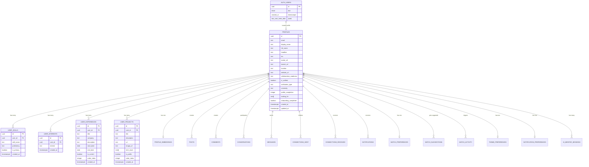
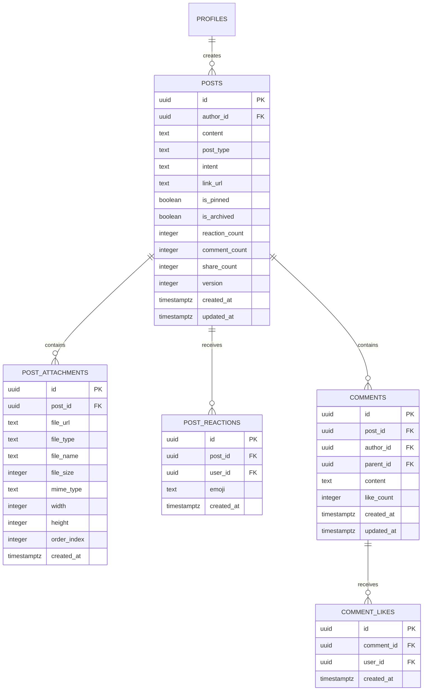
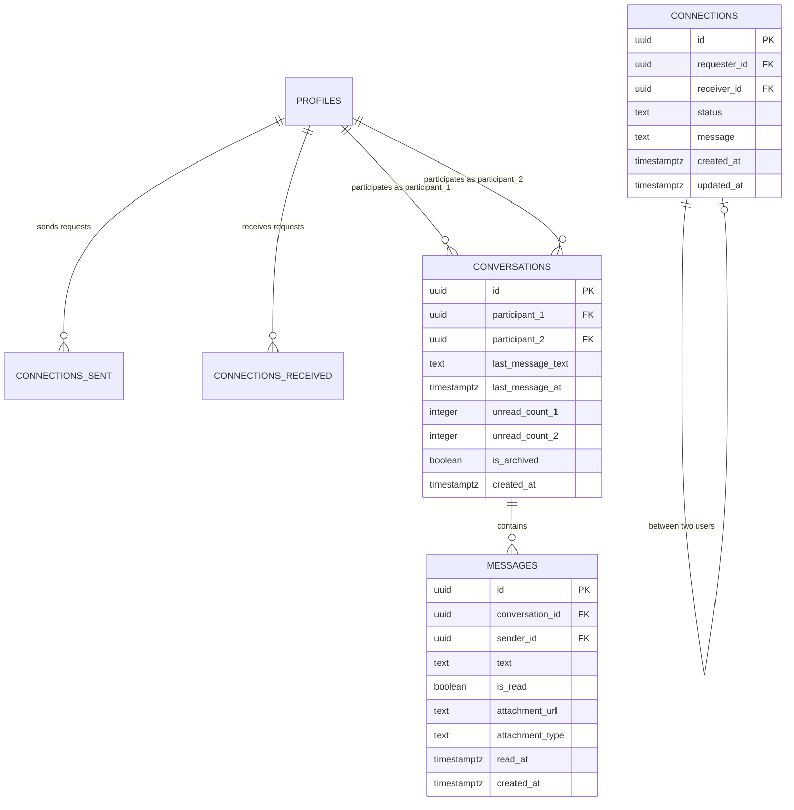
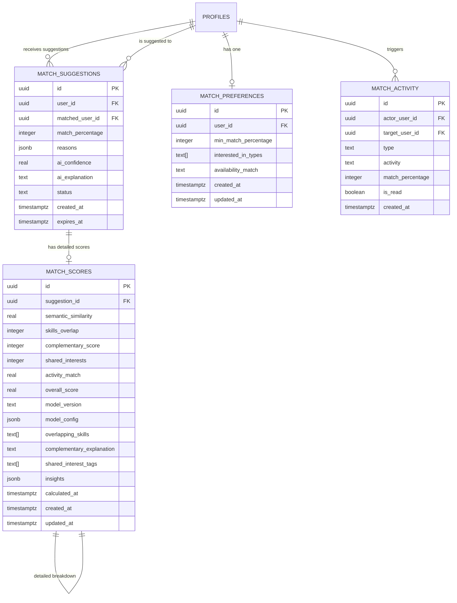
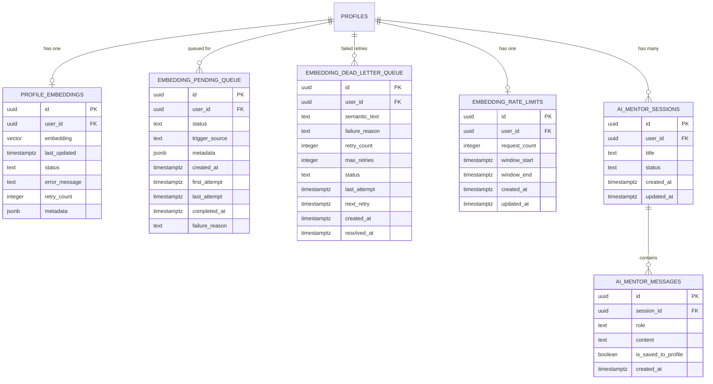
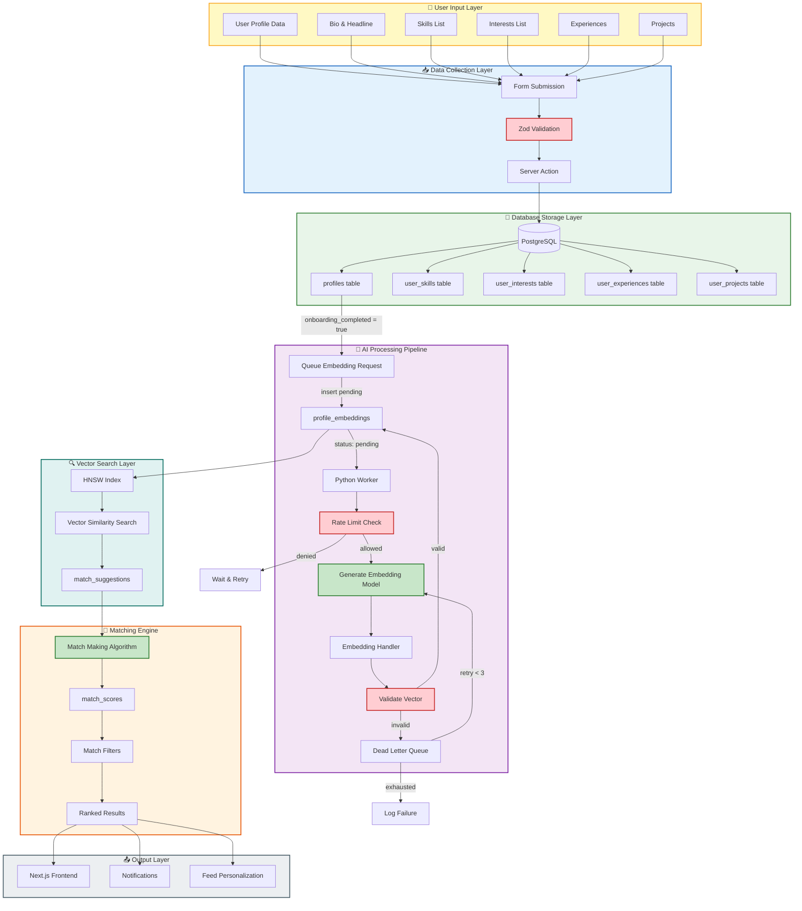
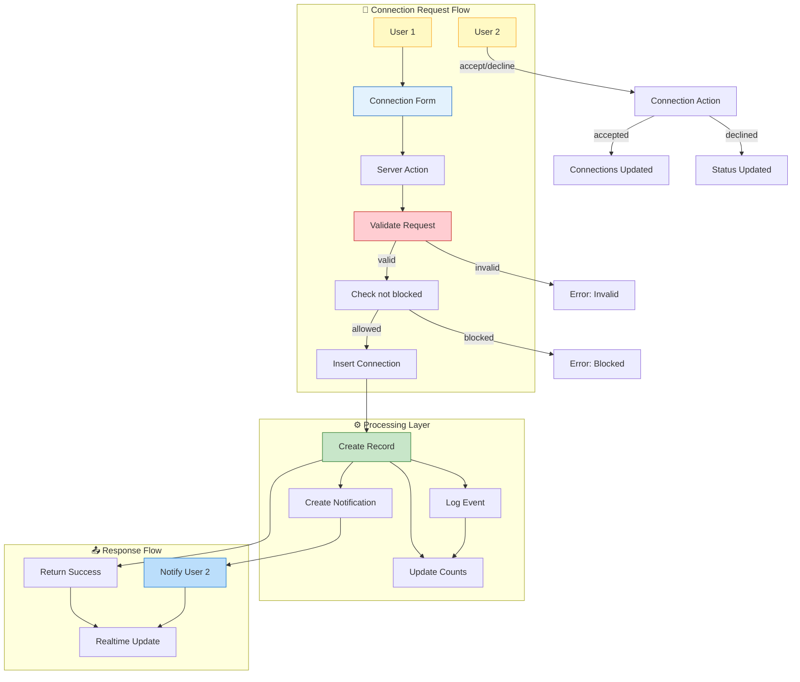
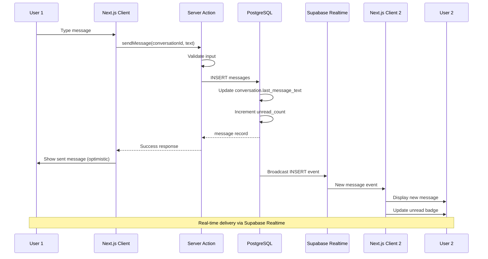
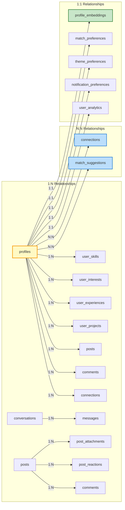

# Data State & Architecture Diagrams

**Last Updated:** 2026-04-30
**Version:** 1.0.0
**Project:** Collabryx - AI-Powered Collaborative Platform
**Database:** Supabase (PostgreSQL 15 + pgvector)

---

## Table of Contents

1. [Entity Relationship Diagram (ERD)](#entity-relationship-diagram-erd)
2. [Data Flow Diagram (DFD)](#data-flow-diagram-dfd)
3. [Table Structure Reference](#table-structure-reference)
4. [Relationship Summary](#relationship-summary)

---

## Entity Relationship Diagram (ERD)

### Core User & Profile Tables

### Social & Content Tables

### Connections & Messaging Tables

### Matching System Tables

### AI & Embeddings Tables

---

## Data Flow Diagram (DFD)

### User Profile Data Flow (AI Analysis Pipeline)

### Connection Request Flow

### Message Send/Receive Flow

---

## Relationship Summary

### Cardinality Overview

---

## Color Legend

| Color | Meaning | Tables/Components |
|-------|---------|-------------------|
| 🟡 Yellow/Gold | Users/Profiles | `profiles`, `auth.users` |
| 🔵 Blue | Transactions/Connections | `connections`, `conversations` |
| 🟢 Green | Positive actions/Stored data | Successful inserts, embeddings |
| 🔴 Red | Constraints/Validations | Checks, blocks, errors |
| 🟣 Purple | AI/ML Processing | Embeddings, match scores |
| 🟩 Teal | Vector/Search | `profile_embeddings`, HNSW index |

---

**Document Version:** 1.0.0
**Last Updated:** 2026-04-30
**Database Version:** 4.1.0
**Maintained By:** Architecture Team