# Process & Workflow Flowcharts

**Last Updated:** 2026-04-30
**Version:** 1.0.0
**Project:** Collabryx - AI-Powered Collaborative Platform

---

## Table of Contents

1. [User Registration & Onboarding Flow](#1-user-registration--onboarding-flow)
2. [AI Agent Execution Flow](#2-ai-agent-execution-flow)

---

## 1. User Registration & Onboarding Flow

*A step-by-step flowchart showing what happens when a student or fresh grad signs up, builds their profile, and gets their initial AI-curated networking suggestions*

```mermaid
%%{init: { 'theme': 'base', 'themeVariables': { 'fontFamily': 'Inter, sans-serif', 'primaryColor': '#2563EB', 'primaryTextColor': '#1E40AF', 'primaryBorderColor': '#3B82F6', 'lineColor': '#64748B', 'secondaryColor': '#10B981', 'tertiaryColor': '#F59E0B' } } }%%
flowchart TD
    %% Start node
    Start(["🎯 START: User Visits Collabryx"])

    %% Authentication Phase
    subgraph Auth_Phase["🔐 PHASE 1: Authentication"]
        direction TB
        LandingPage["🌐 Landing Page"]
        GetStarted["👆 Click 'Get Started'"]
        AuthChoice{"🔄 Choose Auth Method"}
        EmailAuth["📧 Email + Password<br/><small>Supabase Auth</small>"]
        OAuthGoogle["🔵 Continue with Google<br/><small>OAuth 2.0</small>"]
        CreateAccount["📝 Create Account"]
        EmailVerify["📧 Verify Email<br/><small>Magic link sent</small>"]
        AuthSuccess["✅ Authentication Success<br/><small>JWT token stored</small>"]
    end

    %% Onboarding Wizard Phase
    subgraph Onboarding_Phase["📋 PHASE 2: 6-Step Onboarding Wizard"]
        direction TB

        Step1["👋 Step 1: Welcome<br/><small>Platform tour & goals</small>"]
        Step2["👤 Step 2: Basic Info<br/><small>Name, headline, bio</small>"]
        Step3["🎯 Step 3: Skills<br/><small>Add 5-20 skills<br/>Proficiency levels</small>"]
        Step4["💡 Step 4: Interests & Goals<br/><small>Select interests<br/>Define looking_for</small>"]
        Step5["💼 Step 5: Experience<br/><small>Add experiences<br/>Education history</small>"]
        Step6["🔗 Step 6: Links<br/><small>LinkedIn, GitHub, portfolio</small>"]
    end

    %% Data Processing Phase
    subgraph Data_Processing["⚙️ PHASE 3: Data Processing"]
        direction TB
        CompleteOnboarding["📤 completeOnboarding()<br/><small>Server Action</small>"]
        Validate["✅ Zod Validation"]
        UpsertProfile["💾 Upsert Profile<br/><small>profiles table</small>"]
        BatchUpsert["📝 Batch Upsert Skills<br/><small>user_skills table</small>"]
        BatchInterests["📝 Batch Upsert Interests<br/><small>user_interests table</small>"]
        BatchExperience["📝 Batch Upsert Experience<br/><small>user_experiences table</small>"]
        SetOnboarding["✅ Set onboarding_completed = true"]
        QueueEmbedding["📤 Queue Embedding Job<br/><small>embedding_pending_queue</small>"]
    end

    %% Background AI Processing
    subgraph AI_Processing["🤖 PHASE 4: AI Background Processing"]
        direction TB
        WorkerPoll["🐍 Python Worker<br/><small>polls embedding queue</small>"]
        CheckRateLimit{"🚦 Rate Limit Check<br/><small>100 req/min global</small>"}
        LoadModel["📥 Load Sentence Transformer<br/><small>all-MiniLM-L6-v2</small>"]
        BuildSemantic["📝 Build Semantic Text<br/><small>skills + interests + bio</small>"]
        GenerateVector["🔄 Generate 384-dim Vector"]
        ValidateVector{"✅ Validate Vector<br/><small>dimension + range</small>"}
        StoreEmbedding["💾 Store in pgvector<br/><small>profile_embeddings</small>"]
        TriggerMatching["🎯 Trigger Match Generation"]
        DLQ["⚠️ Dead Letter Queue<br/><small>max 3 retries</small>"]
    end

    %% Match Generation
    subgraph Match_Generation["🎯 PHASE 5: Match Generation"]
        direction TB
        FetchEmbeddings["🔍 Fetch All Embeddings<br/><small>Vector similarity search</small>"]
        MultiFactor["📊 Multi-Factor Scoring<br/><small>Semantic 35% | Skills 25% | Interests 20% | Profile 10% | Activity 10%</small>"]
        ApplyFilters["🔇 Apply Filters<br/><small>Exclude connected/blocked</small>"]
        GenerateSuggestions["✨ Generate Top 50<br/><small>match_suggestions table</small>"]
        GenerateScores["📋 Generate match_scores<br/><small>detailed breakdown</small>"]
    end

    %% Notification Phase
    subgraph Notification_Phase["📱 PHASE 6: Notification"]
        direction TB
        QueueNotification["📤 Queue Notification<br/><small>notification_engine</small>"]
        PriorityCheck{"🔔 Check Priority<br/><small>HIGH | MEDIUM | LOW</small>"}
        BatchHIGH["⚡ Immediate Send<br/><small>HIGH priority</small>"]
        BatchMEDIUM["⏰ Batch 5 items<br/><small>MEDIUM priority</small>"]
        BatchLOW["📦 Daily Digest<br/><small>LOW priority</small>"]
    end

    %% Final Dashboard
    Dashboard["🏠 Dashboard<br/><small>View initial matches</small>"]

    %% Flow connections
    Start --> LandingPage
    LandingPage --> GetStarted
    GetStarted --> AuthChoice
    AuthChoice --> EmailAuth
    AuthChoice --> OAuthGoogle
    EmailAuth --> CreateAccount
    OAuthGoogle --> CreateAccount
    CreateAccount --> EmailVerify
    EmailVerify --> AuthSuccess

    AuthSuccess --> Step1
    Step1 --> Step2
    Step2 --> Step3
    Step3 --> Step4
    Step4 --> Step5
    Step5 --> Step6
    Step6 --> CompleteOnboarding

    CompleteOnboarding --> Validate
    Validate --> UpsertProfile
    UpsertProfile --> BatchUpsert
    BatchUpsert --> BatchInterests
    BatchInterests --> BatchExperience
    BatchExperience --> SetOnboarding
    SetOnboarding --> QueueEmbedding

    QueueEmbedding --> WorkerPoll
    WorkerPoll --> CheckRateLimit
    CheckRateLimit -->|allowed| LoadModel
    CheckRateLimit -->|rate limited| WAIT1["⏳ Wait & Retry"]
    LoadModel --> BuildSemantic
    BuildSemantic --> GenerateVector
    GenerateVector --> ValidateVector
    ValidateVector -->|valid| StoreEmbedding
    ValidateVector -->|invalid| DLQ
    DLQ -->|retry < 3| GenerateVector
    DLQ -->|exhausted| FAIL["❌ Log Failure"]
    StoreEmbedding --> TriggerMatching
    TriggerMatching --> FetchEmbeddings

    FetchEmbeddings --> MultiFactor
    MultiFactor --> ApplyFilters
    ApplyFilters --> GenerateSuggestions
    GenerateSuggestions --> GenerateScores
    GenerateScores --> QueueNotification

    QueueNotification --> PriorityCheck
    PriorityCheck -->|HIGH| BatchHIGH
    PriorityCheck -->|MEDIUM| BatchMEDIUM
    PriorityCheck -->|LOW| BatchLOW
    BatchHIGH --> Dashboard
    BatchMEDIUM --> Dashboard
    BatchLOW --> Dashboard

    %% Styling
    style Start fill:#DBEAFE,stroke:#3B82F6,stroke-width:3px
    style Auth_Phase fill:#FEF3C7,stroke:#F59E0B,stroke-width:2px
    style Onboarding_Phase fill:#DBEAFE,stroke:#3B82F6,stroke-width:2px
    style Data_Processing fill:#F0FDF4,stroke:#16A34A,stroke-width:2px
    style AI_Processing fill:#F5F3FF,stroke:#8B5CF6,stroke-width:2px
    style Match_Generation fill:#FCE7F3,stroke:#DB2777,stroke-width:2px
    style Notification_Phase fill:#FFF3E0,stroke:#E65100,stroke-width:2px
    style Dashboard fill:#C8E6C9,stroke:#2E7D32,stroke-width:2px
    style DLQ fill:#FFCDD2,stroke:#C62828,stroke-width:2px
    style WAIT1 fill:#FFCDD2,stroke:#C62828,stroke-width:2px
```

### Onboarding Step Details

| Step | Fields | Validation | Storage |
|------|--------|------------|---------|
| **Welcome** | Goals selection | Required | `user_preferences` |
| **Basic Info** | display_name, headline, bio | 2-100 chars | `profiles` |
| **Skills** | skill_name, proficiency | 5-20 skills | `user_skills` |
| **Interests** | interests[], looking_for[] | 3-10 interests | `user_interests` |
| **Experience** | title, company, dates | Optional | `user_experiences` |
| **Links** | LinkedIn, GitHub, portfolio | URL format | `profiles` |

---

## 2. AI Agent Execution Flow

*A flowchart detailing what triggers an n8n workflow, the decision nodes it passes through, and the final output it generates for the user*

```mermaid
%%{init: { 'theme': 'base', 'themeVariables': { 'fontFamily': 'Inter, sans-serif', 'primaryColor': '#8B5CF6', 'primaryTextColor': '#6D28D9', 'primaryBorderColor': '#A78BFA', 'lineColor': '#64748B', 'secondaryColor': '#10B981', 'tertiaryColor': '#F59E0B' } } }%%
flowchart TD
    %% Trigger Events
    subgraph Triggers["🎯 TRIGGER EVENTS"]
        direction TB
        T1["⏰ Scheduled Cron<br/><small>Every 6 hours</small>"]
        T2["👤 User Action<br/><small>Profile update, new post</small>"]
        T3["🔌 API Call<br/><small>Webhook from external</small>"]
        T4["📊 Batch Job<br/><small>Daily analytics</small>"]
    end

    %% n8n Workflow Engine
    subgraph N8NEngine["📋 n8n Workflow Engine"]
        direction TB
        WorkflowTrigger["🎬 Workflow Trigger<br/><small>Event listener</small>"]
        LogExecution["📝 Log Execution<br/><small>workflow_executions</small>"]
        CheckConditions{"🔄 Conditions Met?"}
    end

    %% Embedding Generator Agent
    subgraph EmbeddingAgent["🔄 Embedding Generator Agent"]
        direction TB
        E1["📥 Fetch Profile Data"]
        E2["🔄 Rate Limit Check<br/><small>3 requests/hour/user</small>"]
        E3["📝 Build Semantic Text<br/><small>Concatenate all fields</small>"]
        E4["🤖 Load Transformer<br/><small>all-MiniLM-L6-v2</small>"]
        E5["🔢 Generate 384-dim Vector"]
        E6{"✅ Vector Valid?"}
        E7["💾 Store in pgvector"]
        E8["📤 Update Queue Status"]
        E9["❌ Move to DLQ<br/><small>Dead Letter Queue</small>"]
        E10["🔁 Retry Logic<br/><small>Exponential backoff</small>"]
    end

    %% Match Generator Agent
    subgraph MatchAgent["🎯 Match Generator Agent"]
        direction TB
        M1["🔍 Fetch Pending Embeddings"]
        M2["📊 Fetch All User Embeddings"]
        M3["🔢 Calculate Cosine Similarity"]
        M4["📊 Multi-Factor Scoring<br/><small>Semantic 35% | Skills 25%</small>"]
        M5["🔇 Apply Business Filters<br/><small>Connected, blocked, inactive</small>"]
        M6["🏆 Rank & Select Top 50"]
        M7["💾 Store match_suggestions"]
        M8["📋 Generate match_scores<br/><small>Detailed breakdown</small>"]
    end

    %% Notification Engine Agent
    subgraph NotificationAgent["📱 Notification Engine Agent"]
        direction TB
        N1["📥 Fetch Pending Notifications"]
        N2["🔔 Priority Classification<br/><small>HIGH | MEDIUM | LOW</small>"]
        N3{"🔔 Priority Level?"}
        N4["⚡ Immediate Send<br/><small>Push + Email</small>"]
        N5["⏰ Batch 5 items<br/><small>5-min window</small>"]
        N6["📦 Daily Digest<br/><small>24-hour window</small>"]
        N7["🔄 Retry on Failure<br/><small>Max 3 attempts</small>"]
        N8["✅ Mark Delivered"]
    end

    %% Circuit Breaker
    subgraph CircuitBreaker["🔄 Circuit Breaker Pattern"]
        direction TB
        CB1["📊 Monitor Error Rate"]
        CB2{"⚠️ Error > 50%?"}
        CB3["🔴 OPEN state<br/><small>Reject requests</small>"]
        CB4["⏰ Timeout: 5 min"]
        CB5["🟡 HALF-OPEN<br/><small>Allow 3 test requests</small>"]
        CB6["🟢 CLOSED<br/><small>Resume normal</small>"]
    end

    %% Output
    subgraph Output["📤 OUTPUT"]
        direction TB
        O1["✨ User Notification<br/><small>New matches available</small>"]
        O2["📊 Analytics Dashboard<br/><small>Match metrics updated</small>"]
        O3["📝 Workflow Complete<br/><small>Update status logs</small>"]
    end

    %% Connections
    Triggers --> N8NEngine
    T1 --> WorkflowTrigger
    T2 --> WorkflowTrigger
    T3 --> WorkflowTrigger
    T4 --> WorkflowTrigger

    WorkflowTrigger --> LogExecution
    LogExecution --> CheckConditions
    CheckConditions -->|yes| EmbeddingAgent
    CheckConditions -->|yes| MatchAgent
    CheckConditions -->|yes| NotificationAgent

    EmbeddingAgent --> E1
    E1 --> E2
    E2 -->|allowed| E3
    E2 -->|exceeded| E10
    E3 --> E4
    E4 --> E5
    E5 --> E6
    E6 -->|yes| E7
    E6 -->|no| E9
    E7 --> E8
    E9 --> E10
    E10 --> E6
    E8 --> MatchAgent

    MatchAgent --> M1
    M1 --> M2
    M2 --> M3
    M3 --> M4
    M4 --> M5
    M5 --> M6
    M6 --> M7
    M7 --> M8
    M8 --> NotificationAgent

    NotificationAgent --> N1
    N1 --> N2
    N2 --> N3
    N3 -->|HIGH| N4
    N3 -->|MEDIUM| N5
    N3 -->|LOW| N6
    N4 --> N7
    N5 --> N7
    N6 --> N7
    N7 --> N8
    N8 --> Output

    %% Circuit Breaker connections
    CB1 --> CB2
    CB2 -->|yes| CB3
    CB2 -->|no| CB6
    CB3 --> CB4
    CB4 --> CB5
    CB5 -->|success| CB6
    CB5 -->|failure| CB3

    %% Error flows
    E9 -.->|"error logged"| CircuitBreaker
    N7 -.->|"failure"| CircuitBreaker

    %% Styling
    style Triggers fill:#FFF9C4,stroke:#F9A825,stroke-width:2px
    style N8NEngine fill:#F5F3FF,stroke:#8B5CF6,stroke-width:2px
    style EmbeddingAgent fill:#E3F2FD,stroke:#1565C0,stroke-width:2px
    style MatchAgent fill:#FCE7F3,stroke:#DB2777,stroke-width:2px
    style NotificationAgent fill:#FFF3E0,stroke:#E65100,stroke-width:2px
    style CircuitBreaker fill:#FFCDD2,stroke:#C62828,stroke-width:2px
    style Output fill:#C8E6C9,stroke:#2E7D32,stroke-width:2px
    style E9 fill:#FFCDD2,stroke:#C62828,stroke-width:2px
    style CB3 fill:#FFCDD2,stroke:#C62828,stroke-width:2px
```

### AI Agent Trigger Matrix

| Trigger Type | Frequency | Workflow Executed | Priority |
|-------------|-----------|------------------|----------|
| **Scheduled Cron** | Every 6 hours | Match Generation | MEDIUM |
| **User Action** | On event | Embedding + Matching | HIGH |
| **API Call** | On webhook | Varies by payload | HIGH |
| **Batch Job** | Daily 00:00 | Analytics + Digest | LOW |

### Agent Configuration

| Agent | Rate Limit | Retry | Timeout |
|-------|-----------|-------|---------|
| **Embedding** | 3/hr/user | 3 with exponential backoff | 30s |
| **Match** | 1/hour | 2 | 60s |
| **Notification** | 10/min | 3 | 15s |

### Circuit Breaker Parameters

| State | Threshold | Duration | Recovery |
|-------|-----------|----------|----------|
| **CLOSED** | Errors < 50% | - | Normal operation |
| **OPEN** | Errors ≥ 50% | 5 minutes | Reject all requests |
| **HALF-OPEN** | 3 test requests | - | Probe recovery |

---

## Color Legend

| Color | Phase | Description |
|-------|-------|-------------|
| 🟡 Yellow | Triggers | Event sources |
| 🔵 Blue | Authentication | User verification |
| 🟢 Green | Processing | Successful operations |
| 🟣 Purple | Orchestration | n8n workflows |
| 🔷 Pink | AI/ML | Embedding, matching |
| 🟠 Orange | Notifications | User alerts |
| 🔴 Red | Errors | Failures, DLQ |

---

*Generated: 2026-04-30 | Collabryx Documentation*