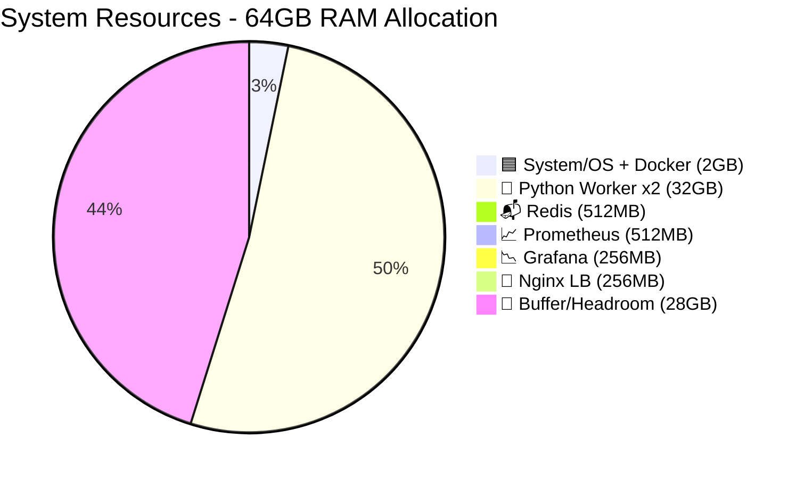
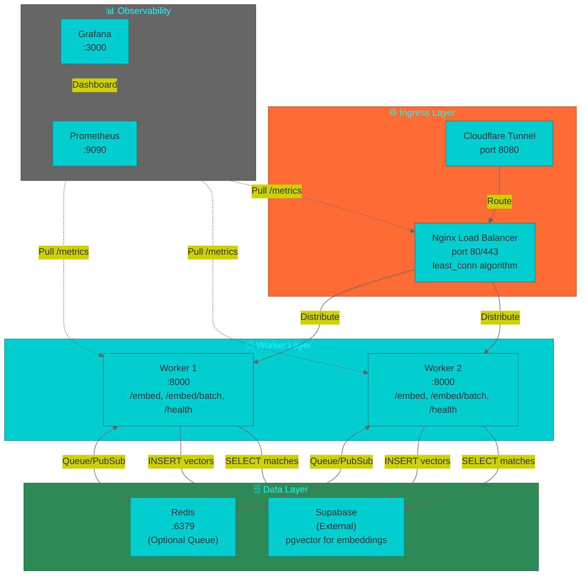

# Infrastructure & Deployment Diagrams

**Last Updated:** 2026-04-30
**Version:** 1.0.0
**Classification:** Infrastructure Documentation

---

## Table of Contents

- [Deployment Architecture](#deployment-architecture)
- [Hardware Resource Allocation](#hardware-resource-allocation)
- [Service Connectivity](#service-connectivity)
- [Monitoring Stack](#monitoring-stack)

---

## Deployment Architecture

### Network Flow Diagram

```mermaid
%%{init: {'theme': 'base', 'themeVariables': { 'primaryColor': '#FF6B35', 'primaryTextColor': '#fff', 'primaryBorderColor': '#FF6B35', 'lineColor': '#666', 'secondaryColor': '#003366', 'tertiaryColor': '#00CED1'}}}%%
flowchart TB
    subgraph External["🌐 EXTERNAL TRAFFIC"]
        direction TB
        Users["👥 Users / Clients"]
        CDNCached["📦 CDN Cache Hits<br/>(Static Assets)"]
        APIRequests["🔄 API Requests<br/>(Dynamic Content)"]
    end

    subgraph Cloudflare["🟠 CLOUDFLARE NETWORK"]
        direction LR
        CF["☁️ Cloudflare<br/>Edge Network"]
        CFProxy["🔒 CF Proxy<br/>(SSL Termination)"]
        CFWAF["🛡️ WAF / DDoS Protection"]
        CFSpeed["⚡ Speed & Caching"]
        CFTunnel["🔗 Cloudflare Tunnel"]
    end

    subgraph VPS["🔵 SELF-HOSTED / LOCAL DOCKER"]
        direction TB
        subgraph DockerHost["🐳 Docker Host"]
            direction LR
            OS["🖥️ Ubuntu 22.04 LTS"]

            subgraph Containers["📦 Container Network (Bridge)"]
                direction TB
                NginxLB["🔄 Nginx Load Balancer<br/>:80/:443"]
                WorkerContainer1["🐍 Python Worker 1<br/>:8000"]
                WorkerContainer2["🐍 Python Worker 2<br/>:8000"]
                RedisContainer["📬 Redis<br/>:6379"]

                subgraph Monitoring["📊 Monitoring Stack"]
                    Prometheus["📈 Prometheus<br/>:9090"]
                    Grafana["📉 Grafana<br/>:3000"]
                end
            end

            DockerEngine["🐳 Docker Engine<br/>(Bridge Driver)"]
        end

        SystemResources["💾 System Resources<br/>64GB RAM | 8 vCPU | 500GB NVMe"]
    end

    subgraph ExternalServices["☁️ EXTERNAL SERVICES"]
        direction LR
        Supabase["🗄️ Supabase<br/>(PostgreSQL + pgvector)<br/>Database as a Service"]
        HuggingFace["🤗 Hugging Face<br/>(Model Cache)"]
        Vercel["▲ Vercel<br/>(Frontend CDN)"]
    end

    Users -->|HTTPS Traffic| CF
    CDNCached -->|Static Content| CFSpeed
    APIRequests -->|Dynamic API| CFProxy
    CFProxy --> CFWAF
    CFWAF -->|Authenticated| CFTunnel
    CFTunnel -->|tunnel://localhost:8080| NginxLB

    CFSpeed -.->|Cached Responses| Users
    CFSpeed -.->|Direct CDN| CDNCached

    NginxLB -->|least_conn| WorkerContainer1
    NginxLB -->|least_conn| WorkerContainer2
    WorkerContainer1 <-->|Pub/Sub| RedisContainer
    WorkerContainer2 <-->|Pub/Sub| RedisContainer
    WorkerContainer1 <-->|Vector Ops| Supabase
    WorkerContainer2 <-->|Vector Ops| Supabase
    WorkerContainer1 -.->|Model Download| HuggingFace
    WorkerContainer2 -.->|Model Download| HuggingFace

    Prometheus -.->|Scrape :8000/metrics| WorkerContainer1
    Prometheus -.->|Scrape :8000/metrics| WorkerContainer2
    Prometheus -.->|Scrape :80/metrics| NginxLB
    Grafana -->|Query| Prometheus

    OS --> DockerEngine
    DockerEngine --> Containers
    DockerEngine --> SystemResources

    SystemResources -.->|16GB RAM| WorkerContainer1
    SystemResources -.->|16GB RAM| WorkerContainer2
    SystemResources -.->|512MB| RedisContainer
    SystemResources -.->|4GB RAM| Monitoring

    style Cloudflare fill:#FF6B35,stroke:#CC5522,stroke-width:2px
    style VPS fill:#003366,stroke:#002244,stroke-width:2px
    style ExternalServices fill:#2E8B57,stroke:#1E6B47,stroke-width:2px
    style Containers fill:#00CED1,stroke:#008B8B,stroke-width:2px
    style Monitoring fill:#666666,stroke:#444444,stroke-width:2px
```

**Bandwidth/Throughput:**

| Path | Throughput |
|------|------------|
| Cloudflare → VPS | 100 Mbps |
| Worker → Supabase | 50 Mbps |
| Redis (local) | 1000 Mbps |

---

### Cloudflare Tunnel Configuration

```mermaid
%%{init: {'theme': 'base', 'themeVariables': { 'primaryColor': '#FF6B35', 'primaryTextColor': '#fff', 'primaryBorderColor': '#FF6B35', 'lineColor': '#666'}}}%%
flowchart LR
    subgraph CloudflareDashboard["🟠 Cloudflare Dashboard"]
        tunnel["🌐 Tunnels"]
        config["⚙️ Tunnel Config"]
        connectors["🔗 Cloudflare Connectors"]
    end

    subgraph TunnelConfig["📝 tunnel.yml Configuration"]
        tunnelName["ingress-collabryx"]
        protocol["protocol: quic"]
        services["services:"]
        workerService["  - name: worker<br/>  url: localhost:8000"]
        grafanaService["  - name: grafana<br/>  url: localhost:3000"]
        promService["  - name: prometheus<br/>  url: localhost:9090"]
    end

    subgraph Security["🔐 Security Rules"]
        waf["🛡️ WAF Rules"]
        originPull["🔒 Origin Pull Verification"]
        tlsVerify["✅ TLS Verification"]
    end

    CloudflareDashboard -->|Create Tunnel| tunnel
    tunnel -->|Configure| TunnelConfig
    TunnelConfig -->|Deploy| connectors
    connectors -->|Protected| Security

    style CloudflareDashboard fill:#FF6B35,stroke:#CC5522
    style TunnelConfig fill:#003366,stroke:#002244
    style Security fill:#666666,stroke:#444444
```

---

## Hardware Resource Allocation

### Resource Distribution Chart

### Container Resource Matrix

```mermaid
%%{init: {'theme': 'base', 'themeVariables': { 'primaryColor': '#00CED1', 'primaryTextColor': '#fff', 'primaryBorderColor': '#00CED1', 'lineColor': '#666'}}}%%
graph TB
    subgraph Hardware["🖥️ VPS Hardware Specs"]
        RAM["💾 64GB DDR4 ECC RAM"]
        CPU["⚙️ 8 vCPU cores<br/>(Intel Xeon / AMD EPYC)"]
        Storage["💿 500GB NVMe SSD"]
        Network["🌐 1Gbps Network"]
    end

    subgraph Allocation["📊 Resource Allocation Matrix"]
        subgraph Workers["🐍 Python Worker Containers"]
            Worker1["Worker 1<br/>2 CPU | 16GB RAM<br/>Limit: 0.5 | 1GB"]
            Worker2["Worker 2<br/>2 CPU | 16GB RAM<br/>Limit: 0.5 | 1GB"]
        end

        subgraph Services["🔧 Infrastructure Services"]
            Redis["📬 Redis<br/>0.5 CPU | 512MB<br/>Limit: 1 | 1GB"]
            Nginx["🔄 Nginx LB<br/>0.5 CPU | 256MB<br/>Limit: 0.5 | 512MB"]
        end

        subgraph Monitor["📊 Monitoring Stack"]
            Prometheus["📈 Prometheus<br/>0.5 CPU | 512MB"]
            Grafana["📉 Grafana<br/>0.25 CPU | 256MB"]
        end
    end

    subgraph Limits["⚠️ Container Limits"]
        CPU_Limit["⚙️ Total CPU: 6 cores"]
        RAM_Limit["💾 Total RAM: 36GB"]
    end

    RAM -->|分配| Worker1
    RAM -->|分配| Worker2
    RAM -->|分配| Redis
    RAM -->|分配| Nginx
    RAM -->|分配| Prometheus
    RAM -->|分配| Grafana

    CPU -->|分配| Worker1
    CPU -->|分配| Worker2
    CPU -->|分配| Redis
    CPU -->|分配| Nginx
    CPU -->|分配| Prometheus
    CPU -->|分配| Grafana

    style Hardware fill:#003366,stroke:#002244,stroke-width:2px
    style Workers fill:#00CED1,stroke:#008B8B,stroke-width:2px
    style Services fill:#00CED1,stroke:#008B8B,stroke-width:2px
    style Monitor fill:#666666,stroke:#444444,stroke-width:2px
    style Limits fill:#FF6B35,stroke:#CC5522,stroke-width:2px
```

---

## Service Connectivity

### Internal Network Communication

---

## Monitoring Stack

### Metrics Flow

```mermaid
%%{init: {'theme': 'base', 'themeVariables': { 'primaryColor': '#666666', 'lineColor': '#666'}}}%%
flowchart LR
    subgraph Collectors["📊 Metrics Collectors"]
        NodeExporter["📦 Node Exporter<br/>(Host:9100)"]
        Cadvisor["🐳 cAdvisor<br/>(Container:8080)"]
        WorkerMetrics["🐍 Worker Metrics<br/>(Custom:8000/metrics)"]
        NginxMetrics["🔄 Nginx Metrics<br/>(:80/metrics)"]
    end

    subgraph Store["💾 Time Series Storage"]
        Prometheus["📈 Prometheus<br/>15-day Retention<br/>:9090"]
    end

    subgraph Visualize["📉 Visualization"]
        Grafana["📊 Grafana<br/>Dashboards<br/>:3000"]
    end

    subgraph Alert["🔔 Alerting"]
        AlertManager["📳 Alertmanager<br/>(PagerDuty/Slack)"]
    end

    NodeExporter -.->|Pull :9100/metrics| Prometheus
    Cadvisor -.->|Pull :8080/metrics| Prometheus
    WorkerMetrics -.->|Pull :8000/metrics| Prometheus
    NginxMetrics -.->|Pull :80/metrics| Prometheus

    Prometheus -->|Query| Grafana
    Prometheus -->|Trigger| AlertManager

    AlertManager -.->|Notify| PagerDuty
    AlertManager -.->|Notify| Slack

    style Collectors fill:#00CED1,stroke:#008B8B
    style Store fill:#003366,stroke:#002244
    style Visualize fill:#666666,stroke:#444444
    style Alert fill:#FF6B35,stroke:#CC5522
```

---

## Legend

### Color Scheme Reference

| Color | Category | Examples |
|-------|----------|----------|
| 🟠 Orange | Network/External | Cloudflare, traffic, bandwidth |
| 🔵 Blue | Server/Infrastructure | VPS, Ubuntu, Docker host |
| 🩵 Cyan | Containers | Worker, Redis, Nginx |
| ⚫ Gray | Monitoring/Logging | Prometheus, Grafana |
| 🟢 Green | Active Services | Supabase, healthy services |

### Resource Units

| Unit | Description |
|------|-------------|
| GB | Gigabytes of RAM |
| vCPU | Virtual CPU cores |
| Mbps | Network throughput |
| :PORT | Container port mapping |

### Architecture Notes

1. **Cloudflare Tunnel**: Eliminates need for open ports on VPS
2. **Nginx Load Balancer**: Distributes traffic using `least_conn` algorithm
3. **Redis**: Optional queue for high-throughput scenarios
4. **Monitoring Stack**: Optional profiles enabled via `docker-compose --profile monitoring`
5. **GPU Allocation**: NVIDIA GPU via docker-compose.scaling.yml (all-MiniLM-L6-v2 model)

---

**Document Version:** 1.0.0
**Last Reviewed:** 2026-04-30
**Maintained By:** Infrastructure Team