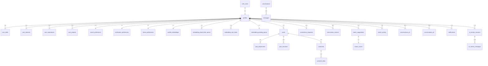

# Collabryx — Backend Object Model Overview

> **Last Updated:** 2026-03-14 (Aligned with Production)  
> **Purpose:** Complete backend schema specification derived from the frontend codebase.
> **Source of Truth:** `supabase/setup/99-master-all-tables.sql`

---

## Table Index

### User Management (Tables 1-5)

| # | Table | Document | Purpose |
|---|-------|----------|---------|
| 1 | `profiles` | [01-profiles.md](./01-profiles.md) | User identity, bio, skills, preferences, avatar, verification |
| 2 | `user_skills` | [02-user-skills.md](./02-user-skills.md) | Many-to-many: Users ↔ Skills |
| 3 | `user_interests` | [03-user-interests.md](./03-user-interests.md) | Interests/industries each user cares about |
| 4 | `user_experiences` | [04-user-experiences.md](./04-user-experiences.md) | Work/education history timeline |
| 5 | `user_projects` | [05-user-projects.md](./05-user-projects.md) | Portfolio projects shown on profile |

### Social Features (Tables 6-11)

| # | Table | Document | Purpose |
|---|-------|----------|---------|
| 6 | `posts` | [06-posts.md](./06-posts.md) | Feed posts with types, media, links |
| 7 | `post_attachments` | [07-post-attachments.md](./07-post-attachments.md) | Media files attached to posts |
| 8 | `post_reactions` | [08-post-reactions.md](./08-post-reactions.md) | Emoji reactions on posts |
| 9 | `comments` | [09-comments.md](./09-comments.md) | Comments under posts |
| 10 | `comment_likes` | [10-comment-likes.md](./10-comment-likes.md) | Likes on comments |
| 11 | `connections` | [11-connections.md](./11-connections.md) | Connection requests between users |

### Matching System (Tables 12-15)

| # | Table | Document | Purpose |
|---|-------|----------|---------|
| 12 | `match_suggestions` | [12-match-suggestions.md](./12-match-suggestions.md) | AI-generated match recommendations |
| 13 | `match_scores` | [13-match-scores.md](./13-match-scores.md) | Detailed match breakdown (skills overlap, complementary, interests) |
| 14 | `match_activity` | [14-match-activity.md](./14-match-activity.md) | Profile views, building-match events |
| 15 | `match_preferences` | [15-match-preferences.md](./15-match-preferences.md) | User's match filter preferences |

### Messaging (Tables 16-17)

| # | Table | Document | Purpose |
|---|-------|----------|---------|
| 16 | `conversations` | [16-conversations.md](./16-conversations.md) | Message threads between users |
| 17 | `messages` | [17-messages.md](./17-messages.md) | Individual chat messages |

### Notifications (Tables 18)

| # | Table | Document | Purpose |
|---|-------|----------|---------|
| 18 | `notifications` | [18-notifications.md](./18-notifications.md) | In-app notification feed |

### AI Features (Tables 19-20)

| # | Table | Document | Purpose |
|---|-------|----------|---------|
| 19 | `ai_mentor_sessions` | [19-ai-mentor-sessions.md](./19-ai-mentor-sessions.md) | AI Mentor conversation sessions |
| 20 | `ai_mentor_messages` | [20-ai-mentor-messages.md](./20-ai-mentor-messages.md) | Messages within AI mentor sessions |

### Preferences (Tables 21-22)

| # | Table | Document | Purpose |
|---|-------|----------|---------|
| 21 | `notification_preferences` | [21-notification-preferences.md](./21-notification-preferences.md) | Email/push notification toggles |
| 22 | `theme_preferences` | [22-theme-preferences.md](./22-theme-preferences.md) | Dark/light mode setting |

### Vector Embeddings (Table 23)

| # | Table | Document | Purpose |
|---|-------|----------|---------|
| 23 | `profile_embeddings` | [23-profile-embeddings.md](./23-profile-embeddings.md) | Vector embeddings for semantic profile matching (384-dim) |

### Embedding Reliability (Tables 24-26)

| # | Table | Document | Purpose |
|---|-------|----------|---------|
| 24 | `embedding_dead_letter_queue` | [24-dead-letter-queue.md](./24-dead-letter-queue.md) | Failed embedding retry queue with exponential backoff |
| 25 | `embedding_rate_limits` | [25-rate-limiting.md](./25-rate-limiting.md) | Rate limiting (3 req/hour/user) to prevent DoS |
| 26 | `embedding_pending_queue` | [26-pending-queue.md](./26-pending-queue.md) | Reliable onboarding embedding queue |

**Total Tables:** 26

---

## Entity Relationship Diagram



### Foreign Key References

| Table | References | On Delete | Constraints |
|-------|-----------|-----------|-------------|
| `profiles` | `auth.users(id)` | CASCADE | PK: id |
| `user_skills` | `profiles(id)` | CASCADE | UNIQUE(user_id, skill_name) |
| `user_interests` | `profiles(id)` | CASCADE | UNIQUE(user_id, interest) |
| `user_experiences` | `profiles(id)` | CASCADE | UNIQUE(user_id, title) |
| `user_projects` | `profiles(id)` | CASCADE | - |
| `posts` | `profiles(id)` | CASCADE | - |
| `post_attachments` | `posts(id)` | CASCADE | - |
| `post_reactions` | `posts(id)`, `profiles(id)` | CASCADE | UNIQUE(post_id, user_id) |
| `comments` | `posts(id)`, `profiles(id)`, `comments(id)` (parent) | CASCADE | - |
| `comment_likes` | `comments(id)`, `profiles(id)` | CASCADE | UNIQUE(comment_id, user_id) |
| `connections` | `profiles(id)` (requester & receiver) | CASCADE | UNIQUE(requester_id, receiver_id), CHECK(requester_id != receiver_id) |
| `match_suggestions` | `profiles(id)` (user & matched_user) | CASCADE | UNIQUE(user_id, matched_user_id) |
| `match_scores` | `match_suggestions(id)` | CASCADE | - |
| `match_activity` | `profiles(id)` (actor & target) | CASCADE | - |
| `match_preferences` | `profiles(id)` | CASCADE | UNIQUE(user_id) |
| `conversations` | `profiles(id)` (participant_1 & participant_2) | CASCADE | UNIQUE(participant_1, participant_2), CHECK(participant_1 < participant_2) |
| `messages` | `conversations(id)`, `profiles(id)` | CASCADE | - |
| `notifications` | `profiles(id)`, `profiles(id)` (actor) | CASCADE / SET NULL | - |
| `ai_mentor_sessions` | `profiles(id)` | CASCADE | - |
| `ai_mentor_messages` | `ai_mentor_sessions(id)` | CASCADE | - |
| `notification_preferences` | `profiles(id)` | CASCADE | UNIQUE(user_id) |
| `theme_preferences` | `profiles(id)` | CASCADE | UNIQUE(user_id) |
| `profile_embeddings` | `profiles(id)` | CASCADE | UNIQUE(user_id) |
| `embedding_dead_letter_queue` | `profiles(id)` | CASCADE | - |
| `embedding_rate_limits` | `profiles(id)` | CASCADE | - |
| `embedding_pending_queue` | `profiles(id)` | CASCADE | UNIQUE(user_id) |

## Auth Provider

Supabase Auth handles `auth.users` automatically. The `profiles` table extends it.

Supported auth methods (frontend):
- **Email/password** (active)
- **Google OAuth** (placeholder)
- **GitHub OAuth** (placeholder)
- **Apple OAuth** (placeholder)

---

## Database Helper Functions

### Connection Functions

| Function | Parameters | Returns | Purpose |
|----------|-----------|---------|---------|
| `are_connected` | `user1 UUID, user2 UUID` | `BOOLEAN` | Check if users are connected |
| `get_connection_status` | `user1_id UUID, user2_id UUID` | `TEXT` | Get connection status (pending/accepted/declined/blocked/not_connected) |
| `get_pending_connection_count` | `target_user_id UUID` | `INTEGER` | Count pending incoming requests |

### Notification Functions

| Function | Parameters | Returns | Purpose |
|----------|-----------|---------|---------|
| `create_notification` | `user_id, type, title, message, data?, actor_id?` | `UUID` | Create notification, returns ID |
| `get_unread_notification_count` | `user_id UUID` | `INTEGER` | Count unread notifications |

### Comment Functions

| Function | Parameters | Returns | Purpose |
|----------|-----------|---------|---------|
| `get_comment_depth` | `comment_id UUID` | `INTEGER` | Get nesting level (0=top-level) |
| `get_comment_replies_count` | `comment_id UUID` | `INTEGER` | Count all replies (including nested) |
| `increment_comment_count` | `post_id UUID` | `VOID` | Increment post comment count |
| `decrement_comment_count` | `post_id UUID` | `VOID` | Decrement post comment count |
| `increment_like_count` | `comment_id UUID` | `VOID` | Increment comment like count |
| `decrement_like_count` | `comment_id UUID` | `VOID` | Decrement comment like count |

### Match-Making Functions

| Function | Parameters | Returns | Purpose |
|----------|-----------|---------|---------|
| `calculate_match_percentage` | `user1_id UUID, user2_id UUID` | `INTEGER` | Calculate match % (0-100) |
| `get_shared_skills` | `user1_id UUID, user2_id UUID` | `TEXT[]` | Array of shared skill names |
| `get_shared_interests` | `user1_id UUID, user2_id UUID` | `TEXT[]` | Array of shared interest names |

### Utility Functions

| Function | Parameters | Returns | Purpose |
|----------|-----------|---------|---------|
| `get_conversation` | `user1 UUID, user2 UUID` | `UUID` | Get conversation ID between users |
| `has_embedding` | `user_id UUID` | `BOOLEAN` | Check if user has completed embedding |
| `get_embedding_status` | `user_id UUID` | `TABLE` | Get embedding status details |
| `get_profile_completion_percentage` | `user_id UUID` | `INTEGER` | Calculate profile completion (0-100) |

---

## Database Triggers

### Automatic Count Updates

| Trigger | Table | Event | Function |
|---------|-------|-------|----------|
| `update_post_reaction_count` | `post_reactions` | INSERT/DELETE | `increment_post_reaction_count()` / `decrement_post_reaction_count()` |
| `update_post_comment_count` | `comments` | INSERT/DELETE | `increment_post_comment_count()` / `decrement_post_comment_count()` |
| `update_comment_like_count` | `comment_likes` | INSERT/DELETE | `increment_comment_like_count()` / `decrement_comment_like_count()` |
| `update_conversation_last_message` | `messages` | INSERT | `update_conversation_last_message()` |
| `update_profiles_updated_at` | `profiles` | UPDATE | `update_updated_at_column()` |

---

## Indexes

### Comments Indexes

```sql
idx_comments_post_id        -- ON comments(post_id)
idx_comments_author_id      -- ON comments(author_id)
idx_comments_parent_id      -- ON comments(parent_id)
idx_comments_post_created   -- ON comments(post_id, created_at DESC)
idx_comments_author         -- ON comments(author_id, created_at DESC)
```

### Connections Indexes

```sql
idx_connections_requester_id    -- ON connections(requester_id)
idx_connections_receiver_id     -- ON connections(receiver_id)
idx_connections_status          -- ON connections(status)
idx_connections_user1_status    -- ON connections(requester_id, status)
idx_connections_user2_status    -- ON connections(receiver_id, status)
```

### Notifications Indexes

```sql
idx_notifications_user_id           -- ON notifications(user_id)
idx_notifications_created_at        -- ON notifications(created_at DESC)
idx_notifications_is_read           -- ON notifications(is_read)
idx_notifications_user_read_created -- ON notifications(user_id, is_read, created_at DESC)
idx_notifications_unread            -- ON notifications(user_id, is_read) WHERE is_read = false
```

---

## Vector Embeddings System

### Overview
Profile embeddings enable semantic matching using 384-dimensional vectors generated by the `all-MiniLM-L6-v2` sentence transformer model.

### Architecture
```
User Profile → Semantic Text → Embedding Generation → Vector Storage → Similarity Search
                    ↓
        Python Worker (Primary)
        Edge Function (Fallback)
```

### Embedding Generation Flow
1. **Profile Data Collection**: Gather profile, skills, interests
2. **Semantic Text Construction**: Format into structured text string
3. **Embedding Generation**:
   - Primary: Python worker with Sentence Transformers
   - Fallback: Supabase Edge Function with local generation
4. **Storage**: Store 384-dim vector in `profile_embeddings` table
5. **Status Tracking**: Real-time updates via Supabase Realtime

### Generation Status States
- `pending` - Initial state, waiting to start
- `processing` - Currently being generated
- `completed` - Successfully generated and stored
- `failed` - Generation failed (retry available)

### Semantic Text Format
```
Role: {role}.
Headline: {headline}.
Bio: {bio}.
Skills: {skill1}, {skill2}, ...
Interests: {interest1}, {interest2}, ...
Goals: {goal1}, {goal2}, ...
Location: {location}.
```

### Model Specifications
- **Model**: `all-MiniLM-L6-v2`
- **Dimensions**: 384
- **Max Sequence Length**: 256 tokens
- **Normalization**: L2 normalized (magnitude ≈ 1.0)
- **Use Case**: Semantic search, profile matching

### Fallback Mechanism
If Python worker is unavailable:
1. Edge Function attempts local TF-IDF style embedding
2. Marks response with `used_fallback: true`
3. Logs fallback usage for monitoring
